# Terraform Parameterized AWS Infrastructure — Automated EC2 Provisioning, Configuration & Outputs

[](https://developer.hashicorp.com/terraform)
[](https://aws.amazon.com/)
[](https://aws.amazon.com/ec2/)
[](https://developer.hashicorp.com/terraform)
[](https://github.com/olajide-adedayo/terraform-parameterized-aws-infrastructure)

---


Table of Contents

- "1. Project Overview" (#1-project-overview)
- "2. Business & Technical Objectives" (#2-business--technical-objectives)
- "3. Solution Architecture" (#3-solution-architecture)
- "4. Technology Stack" (#4-technology-stack)
- "5. AWS Infrastructure" (#5-aws-infrastructure)
- "6. Terraform Configuration & Parameterization" (#6-terraform-configuration--parameterization)
- "7. Terraform Provisioners & Server Configuration" (#7-terraform-provisioners--server-configuration)
- "8. Deployment & Automation Workflow" (#8-deployment--automation-workflow)
- "9. Validation & Verification" (#9-validation--verification)
- "10. Troubleshooting & Lessons from Deployment" (#10-troubleshooting--lessons-from-deployment)
- "11. Infrastructure Lifecycle Management" (#11-infrastructure-lifecycle-management)
- "12. Project Structure & File Organization" (#12-project-structure--file-organization)
- "13. Security Considerations" (#13-security-considerations)
- "14. Cost Optimization & Operational Considerations" (#14-cost-optimization--operational-considerations)
- "15. Testing Strategy & Infrastructure Validation" (#15-testing-strategy--infrastructure-validation)
- "16. Implementation Evidence & Screenshots" (#16-implementation-evidence--screenshots)
- "17. Limitations, Production Readiness & Future Improvements" (#17-limitations-production-readiness--future-improvements)
- "18. Professional DevOps & IaC Practices Demonstrated" (#18-professional-devops--iac-practices-demonstrated)
- "19. Project Completion Summary & Key Takeaways" (#19-project-completion-summary--key-takeaways)
- "20. Repository Usage & Deployment Guide" (#20-repository-usage--deployment-guide)

## 1. Project Overview

This project demonstrates the practical use of **Terraform Infrastructure as Code (IaC)** to provision, configure, validate, and manage an **Amazon EC2 application server on AWS** using reusable and parameterized infrastructure configuration.

The infrastructure is defined through Terraform configuration files and controlled through input variables, allowing key deployment parameters such as the **AWS Region, Availability Zone, EC2 instance type, instance name, SSH user, SSH key pair, and private key path** to be configured without modifying the core infrastructure definition.

The project also demonstrates Terraform's **file, remote-exec, and local-exec provisioners** as part of a hands-on infrastructure automation exercise. After provisioning the EC2 instance, Terraform transfers a deployment script to the server, executes the script remotely, installs and configures the **Apache HTTP Server**, and captures the instance's private IP address locally.

### Key Capabilities Demonstrated

- **Infrastructure as Code (IaC)** using Terraform
- **Parameterized AWS infrastructure** using Terraform input variables
- **Amazon EC2 provisioning** with configurable deployment parameters
- **AWS security group configuration** for HTTP and SSH access
- **Terraform file provisioner** for transferring deployment assets
- **Terraform remote-exec provisioner** for post-provisioning configuration
- **Terraform local-exec provisioner** for local automation and output capture
- **Automated Apache web server installation and configuration**
- **Terraform output values** for EC2 public and private IP addresses
- **Infrastructure validation** through SSH, service-status checks, and browser testing
- **Infrastructure troubleshooting** involving AMI architecture, AWS networking, DNS, SSH connectivity, and resource replacement
- **Terraform resource lifecycle management**, including controlled replacement and cleanup
- **Git and GitHub version control** for infrastructure source code and project evidence

### Project Outcome

The implementation successfully provisioned an AWS EC2 instance, configured Apache through Terraform provisioners, verified the running web service, captured Terraform outputs, and validated the deployed application through a web browser.

After successful validation, the temporary AWS resources were **destroyed using Terraform** to demonstrate responsible infrastructure lifecycle management and prevent unnecessary ongoing cloud charges.

> **Portfolio Note:** Terraform provisioners are used intentionally in this project as a learning and demonstration mechanism. For production-grade infrastructure automation, approaches such as cloud-init/user data, AWS Systems Manager, configuration-management tools, immutable machine images, or dedicated deployment pipelines are generally preferable.

 ---

 ## 2. Business & Technical Objectives

### Business Objectives

The project was designed to demonstrate how Infrastructure as Code can improve the consistency, repeatability, and efficiency of cloud infrastructure deployment.

The key business objectives were to:

- Reduce manual infrastructure provisioning and configuration.
- Improve deployment consistency through declarative infrastructure.
- Enable repeatable infrastructure deployments using parameterized configuration.
- Reduce configuration errors associated with manual server setup.
- Demonstrate controlled infrastructure lifecycle management.
- Establish a version-controlled approach to cloud infrastructure.
- Provide clear infrastructure outputs for operational visibility and validation.
- Demonstrate responsible cloud cost management through infrastructure cleanup after testing.

### Technical Objectives

The technical objectives were to:

- Provision an **Amazon EC2 instance using Terraform**.
- Parameterize infrastructure using Terraform input variables.
- Configure AWS infrastructure using reusable Terraform configuration.
- Configure an **AWS security group** for HTTP and SSH access.
- Use Terraform's **file provisioner** to transfer a deployment script to the EC2 instance.
- Use the **remote-exec provisioner** to execute server configuration commands remotely.
- Use the **local-exec provisioner** to capture infrastructure information locally.
- Automatically install and configure **Apache HTTP Server**.
- Define Terraform **output values** for EC2 public and private IP addresses.
- Validate infrastructure through Terraform outputs, SSH connectivity, service-status checks, and browser-based application testing.
- Demonstrate Terraform resource replacement and infrastructure reconciliation.
- Demonstrate complete infrastructure cleanup using `terraform destroy`.
- Maintain infrastructure source code and project evidence in **Git and GitHub**.

---

## 3. Solution Architecture

The solution uses **Terraform as the Infrastructure as Code (IaC) control layer** to provision and configure an Amazon EC2 application server on AWS.

The architecture combines parameterized Terraform variables, AWS infrastructure resources, Terraform provisioners, Apache web server configuration, Terraform outputs, validation, troubleshooting, and infrastructure cleanup into a complete cloud infrastructure lifecycle workflow.

### Architecture Components

- **Terraform** — Infrastructure as Code and infrastructure automation
- **AWS Provider** — Enables Terraform to interact with AWS resources
- **Amazon EC2** — Hosts the application and web server
- **AWS Security Group** — Controls inbound HTTP and SSH traffic
- **Ubuntu Linux** — Operating system used by the EC2 instance
- **Apache HTTP Server** — Web server installed and configured through Terraform
- **File Provisioner** — Transfers the deployment script to the EC2 instance
- **Remote-Exec Provisioner** — Executes server configuration commands remotely
- **Local-Exec Provisioner** — Captures the EC2 private IP address locally
- **Terraform Outputs** — Expose the EC2 public and private IP addresses
- **GitHub** — Provides version control and project documentation

### Architecture Diagram

The architecture below shows how Terraform interacts with AWS resources and how the provisioned EC2 server is configured and validated.

```text
                    TERRAFORM CONTROL LAYER
                             |
                             v
                    Terraform Configuration
                             |
                             v
                       Input Variables
                             |
                             v
                       AWS Provider
                             |
                             v
                +---------------------------+
                |       AWS ENVIRONMENT     |
                |                           |
                |   Security Group          |
                |        |                  |
                |        v                  |
                |   Amazon EC2              |
                |        |                  |
                |        v                  |
                |   Ubuntu Linux            |
                |        |                  |
                |        v                  |
                |   Apache Web Server       |
                |        |                  |
                |        v                  |
                |   Web Application         |
                +---------------------------+
                             |
                             v
                     Validation & Testing
                             |
                             v
                      Terraform Outputs
                             |
                             v
                    Infrastructure Cleanup
```

### End-to-End Automation Workflow

The workflow below shows the complete sequence used to provision, configure, validate, and clean up the AWS infrastructure.

```text
1. Initialize Terraform
          |
          v
2. Define Infrastructure Parameters
          |
          v
3. Provision EC2 and Security Group
          |
          v
4. Transfer Deployment Script
          |
          v
5. Execute Deployment Script Remotely
          |
          v
6. Install and Configure Apache
          |
          v
7. Start Apache Web Service
          |
          v
8. Capture EC2 Private IP Address
          |
          v
9. Generate Terraform Outputs
          |
          v
10. Validate SSH Connectivity
          |
          v
11. Verify Apache Service Status
          |
          v
12. Verify Web Application in Browser
          |
          v
13. Manage Infrastructure Lifecycle
          |
          v
14. Destroy Temporary AWS Resources
          |
          v
       AWS Resources
          Cleaned Up
```

### Architecture Note

> **Architecture Note:** Terraform provisioners are used intentionally in this project as a hands-on automation and learning mechanism. For production environments, server configuration would generally be handled through approaches such as cloud-init, user data, AWS Systems Manager, immutable machine images, configuration-management tools, or dedicated deployment pipelines.

### Cost Management Note

> **Cost Management Note:** The AWS infrastructure created for this project was temporary. After successful validation, the EC2 instance and security group were destroyed using Terraform to prevent unnecessary ongoing cloud charges.

---

## 4. Technology Stack

| Category | Technology | Purpose |
|---|---|---|
| Infrastructure as Code | Terraform 1.14.8 | Provisioning and managing AWS infrastructure |
| Cloud Platform | Amazon Web Services (AWS) | Cloud infrastructure hosting |
| Compute | Amazon EC2 | Hosting the application and web server |
| Operating System | Ubuntu Linux | Operating system for the EC2 instance |
| Web Server | Apache HTTP Server | Serving the deployed web application |
| Cloud Networking | AWS Security Group | Controlling inbound HTTP and SSH traffic |
| Configuration Automation | Terraform Provisioners | Automating post-provisioning server configuration |
| Infrastructure Outputs | Terraform Outputs | Exposing EC2 public and private IP addresses |
| Scripting | Bash | Automating Apache installation and web server configuration |
| Version Control | Git | Tracking infrastructure code changes |
| Source Code Management | GitHub | Hosting Terraform code and project documentation |
| CLI Tools | AWS CLI | AWS resource inspection and troubleshooting |
| Development Environment | Windows + Git Bash | Local Terraform development and execution |


---

## 5. AWS Infrastructure

The project uses a lightweight AWS infrastructure design focused on demonstrating Terraform-based EC2 provisioning, server configuration, network access control, validation, and lifecycle management.

### AWS Resources

| Resource | Configuration | Purpose |
|---|---|---|
| Amazon EC2 | t3.micro | Hosts the Ubuntu application and web server |
| Operating System | Ubuntu Linux | Provides the server operating environment |
| AWS Security Group | HTTP and SSH access | Controls inbound network traffic |
| Availability Zone | us-east-1a | Determines the EC2 deployment location |
| AWS Region | us-east-1 | Primary AWS deployment region |
| EC2 Key Pair | olajide-key | Provides SSH authentication |
| Apache HTTP Server | Installed through Terraform automation | Serves the web application |

### EC2 Configuration

The EC2 instance is provisioned using Terraform with configurable deployment parameters.

The following parameters are controlled through Terraform variables:

- AWS Region
- Availability Zone
- Amazon Machine Image
- EC2 instance type
- Instance name
- SSH username
- EC2 key pair
- Local private key path

The project uses the **t3.micro** instance type with an Ubuntu AMI compatible with the selected EC2 architecture.

### Security Group Configuration

The EC2 security group provides the network access required for infrastructure management and web application validation.

| Protocol | Port | Source | Purpose |
|---|---:|---|---|
| TCP | 22 | 0.0.0.0/0 | SSH administration and Terraform remote provisioning |
| TCP | 80 | 0.0.0.0/0 | HTTP access to the Apache web server |

> **Security Note:** SSH access from 0.0.0.0/0 was used for this hands-on demonstration to simplify remote connectivity and Terraform provisioning. In a production environment, SSH access should be restricted to trusted source IP addresses, VPN/private connectivity, or replaced with AWS Systems Manager Session Manager where appropriate.

### Infrastructure Lifecycle

The AWS resources followed a complete Terraform-managed lifecycle:

1. Infrastructure configuration was defined using Terraform.
2. Terraform created the EC2 instance and Security Group.
3. Provisioners configured the EC2 server and Apache web service.
4. Terraform outputs exposed the EC2 public and private IP addresses.
5. SSH, Apache service status, and browser-based HTTP access were used for validation.
6. Terraform managed resource replacement during troubleshooting and reconciliation.
7. After successful testing, Terraform destroyed the temporary AWS resources.

> **Cost Management:** The infrastructure was intentionally temporary. The EC2 instance and Security Group were destroyed after validation to avoid unnecessary ongoing AWS charges.

---

## 6. Terraform Configuration & Parameterization

The infrastructure is designed using Terraform variables to separate deployment parameters from the core resource definitions. This allows the same Terraform configuration to be reused with different deployment values without modifying the infrastructure resource code.

### Parameterized Configuration

The project uses Terraform input variables for key infrastructure and connection parameters, including:

| Variable | Purpose | Example |
|---|---|---|
| aws_region | AWS Region for deployment | us-east-1 |
| availability_zone | Availability Zone for the EC2 instance | us-east-1a |
| ami_ids | Region-specific Ubuntu AMI mapping | us-east-1 |
| instance_type | EC2 instance size | t3.micro |
| instance_name | EC2 Name tag | terraform-parameterized-app-server |
| ssh_user | SSH user for remote configuration | ubuntu |
| private_key_path | Local path to the SSH private key | Local Windows path |
| key_name | AWS EC2 key pair name | olajide-key |

### Variable-Driven Infrastructure

The Terraform configuration uses these variables to control the EC2 deployment.

This approach provides several advantages:

- Reduces hard-coded infrastructure values.
- Makes the configuration easier to reuse.
- Simplifies deployment to different AWS Regions.
- Allows EC2 sizing to be changed without modifying the resource definition.
- Separates configuration values from infrastructure logic.
- Improves maintainability and readability.
- Supports consistent infrastructure deployment across environments.

### Region-Aware AMI Selection

The project uses a Terraform map variable to associate Ubuntu AMI IDs with AWS Regions.

The EC2 resource selects the appropriate AMI based on the configured AWS Region.

This demonstrates how Terraform expressions can be used to create more flexible infrastructure configurations while avoiding unnecessary duplication of resource definitions.

### Example Variable Configuration

A sample configuration file is provided in the repository as:

**terraform.tfvars.example**

The example demonstrates the expected deployment parameters without exposing sensitive credentials or private key material.

### Sensitive Infrastructure Parameters

The project requires the local SSH private key path for Terraform provisioner connectivity.

The actual private key file and environment-specific Terraform variable file are excluded from version control through `.gitignore`.

This prevents sensitive local configuration and credentials from being committed to the public GitHub repository.

> **Security Note:** Private keys, credentials, and other sensitive infrastructure values should never be committed to source control. Production implementations should use secure secret-management solutions and least-privilege access controls.

### Terraform Configuration Flow

```text
Terraform Variables
        |
        v
Deployment Parameters
        |
        v
Terraform Resource Configuration
        |
        v
AWS Provider
        |
        v
AWS Infrastructure
        |
        v
Provisioned EC2 Server
```

### Reusability

The parameterized design allows the infrastructure to be adapted by changing variable values rather than rewriting the Terraform resource definitions.

For example, the EC2 instance type, AWS Region, Availability Zone, instance name, and SSH configuration can be changed through variables while maintaining the same underlying infrastructure structure.

---

## 7. Terraform Provisioners & Server Configuration

This project demonstrates Terraform provisioners as part of the EC2 post-provisioning automation process.

After Terraform creates the EC2 instance, provisioners are used to transfer the deployment script, execute server configuration commands, and capture infrastructure information locally.

### Provisioner Workflow

```text
EC2 Instance Created
        |
        v
File Provisioner
        |
        v
Deployment Script Transferred
        |
        v
Remote-Exec Provisioner
        |
        v
Deployment Script Executed
        |
        v
Apache Installed
        |
        v
Apache Configured
        |
        v
Apache Started
        |
        v
Local-Exec Provisioner
        |
        v
Private IP Captured Locally
```

### File Provisioner

The **file provisioner** transfers the deployment script from the local Terraform project directory to the EC2 instance.

The deployment script is transferred to the temporary directory on the Ubuntu server before remote execution.

```hcl
provisioner "file" {
  source      = "web.sh"
  destination = "/tmp/web.sh"
}
```

### Remote-Exec Provisioner

The **remote-exec provisioner** connects to the EC2 instance through SSH and executes the required server configuration commands.

The provisioner makes the deployment script executable and then runs it with elevated privileges.

```hcl
provisioner "remote-exec" {
  inline = [
    "chmod +x /tmp/web.sh",
    "sudo /tmp/web.sh"
  ]
}
```

### Apache Server Configuration

The deployment script automates the installation and configuration of the Apache HTTP Server.

The configuration process includes:

1. Updating the Ubuntu package index.
2. Installing Apache HTTP Server.
3. Enabling the Apache service.
4. Starting the Apache service.
5. Removing the default Apache web page.
6. Creating a custom project web page.
7. Making the application available through HTTP port 80.

### Local-Exec Provisioner

The **local-exec provisioner** executes a command on the local machine after the EC2 instance has been provisioned.

In this project, it captures the EC2 private IP address and writes the value to a local file for verification and operational visibility.

```hcl
provisioner "local-exec" {
  command = "echo ${self.private_ip} > private_ips.txt"
}
```

### SSH Connection Configuration

The file and remote-exec provisioners use SSH to communicate with the Ubuntu EC2 instance.

The connection configuration uses:

- SSH connection type
- Ubuntu SSH user
- EC2 key pair authentication
- Local private key
- EC2 public IP address

The private key remains on the local system and is excluded from Git version control.

### Provisioning Outcome

The provisioner workflow successfully automated the transition from a newly provisioned EC2 instance to a running Apache web server.

The resulting infrastructure was validated through:

- Successful SSH connection to the EC2 instance.
- Apache service status verification.
- Terraform output verification.
- Private IP capture.
- Browser-based HTTP testing.
- Successful display of the custom Apache web page.

> **Production Consideration:** Terraform provisioners are useful for demonstrations and specific infrastructure tasks, but they are generally considered a last resort for production configuration management. Production environments should preferably use approaches such as cloud-init, EC2 user data, AWS Systems Manager, immutable machine images, configuration-management tools, or dedicated deployment pipelines.

---

## 8. Deployment & Automation Workflow

The deployment process follows a structured Terraform workflow that provisions the AWS infrastructure, configures the EC2 server, validates the application, and manages the infrastructure lifecycle.

### Deployment Workflow

```text
                    START
                      |
                      v
             Terraform Configuration
                      |
                      v
               Terraform Init
                      |
                      v
              Terraform Validate
                      |
                      v
                Terraform Plan
                      |
                      v
              Review Changes
                      |
                      v
               Terraform Apply
                      |
                      v
          EC2 Instance Provisioned
                      |
                      v
             File Provisioner
                      |
                      v
          Deployment Script Transfer
                      |
                      v
           Remote-Exec Provisioner
                      |
                      v
       Apache Installation & Configuration
                      |
                      v
            Local-Exec Provisioner
                      |
                      v
           Private IP Captured
                      |
                      v
            Terraform Outputs
                      |
                      v
              Infrastructure
                Validation
                      |
          +-----------+-----------+
          |           |           |
          v           v           v
         SSH       Apache       Browser
      Validation    Status      Testing
          |           |           |
          +-----------+-----------+
                      |
                      v
              Successful Deployment
                      |
                      v
             Terraform Destroy
                      |
                      v
              Resources Removed
                      |
                      v
                     END
```

### Terraform Initialization

The Terraform working directory is initialized before infrastructure operations begin.

Initialization downloads the required provider plugins and prepares the working directory for Terraform operations.

```text
terraform init
```

### Configuration Validation

The Terraform configuration is validated to identify syntax and configuration errors before attempting infrastructure deployment.

```text
terraform validate
```

### Infrastructure Planning

Terraform generates an execution plan showing the infrastructure changes that would be made.

```text
terraform plan
```

The plan provides an opportunity to review the proposed infrastructure changes before applying them to AWS.

### Infrastructure Provisioning

The infrastructure is provisioned using Terraform.

```text
terraform apply
```

Terraform creates the required AWS resources and then executes the configured provisioning workflow.

### Post-Provisioning Automation

After the EC2 instance becomes available, the provisioning process performs the following operations:

1. Transfers the deployment script to the EC2 instance.
2. Establishes an SSH connection to the server.
3. Makes the deployment script executable.
4. Executes the deployment script remotely.
5. Installs Apache HTTP Server.
6. Enables and starts the Apache service.
7. Deploys the custom project web page.
8. Captures the EC2 private IP address locally.

### Infrastructure Outputs

Terraform exposes the EC2 public and private IP addresses through output values.

These outputs provide useful information for infrastructure verification and operational visibility after deployment.

### Deployment Validation

The deployment was validated at multiple levels.

#### 1. Terraform Validation

Terraform outputs and execution results were reviewed to confirm successful infrastructure provisioning.

#### 2. SSH Validation

SSH connectivity was established successfully with the provisioned Ubuntu EC2 instance.

#### 3. Apache Service Validation

The Apache service was checked on the EC2 instance to confirm that the web server was active and running.

#### 4. Browser Validation

The EC2 public IP address was accessed through a web browser to confirm that the custom Apache web page was successfully served over HTTP.

### Infrastructure Cleanup

After successful testing and validation, the temporary AWS resources were removed using Terraform.

```text
terraform destroy
```

The destroy operation successfully removed the EC2 instance and associated Security Group.

> **Lifecycle Principle:** The project demonstrates the complete infrastructure lifecycle of provision, configure, validate, and destroy rather than stopping after initial resource creation.


---

## 9. Validation & Verification

Validation was performed at multiple layers to confirm that the Terraform deployment successfully created the AWS infrastructure, configured the EC2 server, and made the Apache web application accessible.

### Validation Strategy

```text
Terraform Deployment
        |
        v
Infrastructure Validation
        |
        +-------------------+
        |                   |
        v                   v
Terraform Outputs      AWS Resources
        |                   |
        +---------+---------+
                  |
                  v
          EC2 Connectivity
                  |
                  v
            SSH Validation
                  |
                  v
        Apache Service Check
                  |
                  v
        HTTP Browser Testing
                  |
                  v
       Successful Deployment
```

### Terraform Output Verification

Terraform output values were used to confirm the public and private IP addresses assigned to the EC2 instance.

The deployment produced the following values during successful validation:

- **Public IP:** 44.200.225.123
- **Private IP:** 172.31.3.119

The private IP was also captured locally through the Terraform local-exec provisioner.

### SSH Connectivity Verification

SSH connectivity was successfully established with the provisioned Ubuntu EC2 instance.

This confirmed that:

- The EC2 instance was running.
- The assigned SSH key pair was correctly configured.
- Network connectivity to the instance was available.
- The Terraform provisioning connection parameters were functional.

### Apache Service Verification

The Apache HTTP Server service was checked directly on the EC2 instance.

The service was confirmed to be:

- Installed successfully.
- Enabled to start automatically.
- Running successfully.
- Ready to serve HTTP requests.

### Browser-Based Web Verification

The EC2 public IP address was accessed through a web browser to validate the deployed web application.

The custom project page was successfully displayed, confirming that:

- Apache was serving the application.
- HTTP port 80 was accessible.
- The EC2 security group allowed the required HTTP traffic.
- The server configuration completed successfully.
- The deployment script executed as expected.

### Validation Evidence

The repository contains screenshots documenting key stages of the deployment and validation process, including:

- Terraform variable configuration and planning.
- Provisioner execution planning.
- EC2 resource provisioning.
- Successful Terraform apply.
- Terraform output values.
- Apache service status.
- Browser-based web application verification.

### Final Validation Result

The infrastructure successfully passed the required validation checks.

| Validation Area | Result |
|---|---|
| Terraform Configuration | Successful |
| EC2 Provisioning | Successful |
| Security Group Configuration | Successful |
| SSH Connectivity | Successful |
| Deployment Script Execution | Successful |
| Apache Installation | Successful |
| Apache Service Status | Running |
| Terraform Outputs | Verified |
| Private IP Capture | Verified |
| HTTP Connectivity | Successful |
| Browser Application Test | Successful |
| Infrastructure Cleanup | Successful |

> **Validation Outcome:** The project successfully demonstrated an end-to-end Terraform deployment in which AWS infrastructure was provisioned, configured, verified, and subsequently destroyed through controlled infrastructure lifecycle operations.


---

## 10. Troubleshooting & Lessons from Deployment

This project involved several real-world infrastructure and connectivity issues during AWS provisioning and Terraform execution. Troubleshooting covered EC2 architecture compatibility, SSH connectivity, Windows path handling, AWS networking and DNS resolution, Terraform provisioner behavior, resource replacement, public IP lifecycle, and infrastructure state reconciliation.

The troubleshooting process provided practical experience beyond simply writing Terraform configuration. Each issue required identifying the failure point, determining the underlying cause, applying a controlled resolution, and validating the infrastructure again.

## 10.1 Troubleshooting Summary

| Issue | Root Cause | Resolution |
|---|---|---|
| EC2 instance creation failed | The selected Ubuntu AMI architecture was incompatible with the selected EC2 instance type | Replaced the incompatible AMI with an architecture-compatible Ubuntu AMI |
| Terraform could not access the SSH private key | Windows path formatting caused the private key path to be interpreted incorrectly | Corrected the Terraform private key path |
| EC2 instance had no usable key pair configuration | The required EC2 key pair was not initially associated with the instance | Added the required EC2 key pair configuration |
| Terraform AWS API connectivity failed | DNS and network connectivity problems affected communication with AWS endpoints | Investigated DNS and network connectivity before retrying Terraform operations |
| File provisioner SSH connection timed out | Temporary network connectivity prevented Terraform from establishing SSH access to the EC2 instance | Verified the instance, public IP, security group, SSH port, key pair, and direct SSH connectivity |
| Provisioner execution failed during EC2 replacement | The replacement instance was temporarily unreachable during provisioning | Verified direct SSH connectivity and used Terraform's controlled replacement workflow |
| HTTP service was initially unreachable | The EC2 infrastructure state and public IP address had changed during lifecycle operations | Revalidated the active instance, public IP, security group, and Apache service |
| Terraform resource became tainted | A provisioner failure caused Terraform to mark the EC2 resource for replacement | Used Terraform's resource replacement workflow to recreate the instance |
| Public IP address changed after lifecycle operations | A standard EC2 public IPv4 address is not guaranteed to remain the same through certain instance lifecycle operations | Rechecked Terraform outputs and used the current public IP for validation |

10.2 AMI and Instance Architecture Compatibility

One of the first deployment issues involved an incompatibility between the selected Ubuntu AMI architecture and the EC2 instance type.

The selected "t3.micro" instance requires an x86-compatible AMI, while the initially selected Ubuntu AMI was ARM64-based.

AWS rejected the configuration during EC2 creation because the AMI architecture and instance type were incompatible.

The issue was resolved by selecting an Ubuntu AMI compatible with the architecture supported by the "t3.micro" instance.

This reinforced an important AWS infrastructure principle:

«EC2 instance type and AMI architecture must be compatible before an instance can be successfully launched.»

For parameterized Terraform configurations, AMI selection should therefore be treated as an infrastructure compatibility requirement rather than simply an input value.

10.3 SSH Private Key Path Troubleshooting

Terraform provisioners required SSH access to the Ubuntu EC2 instance.

The initial Windows private-key path caused Terraform to have difficulty locating or interpreting the SSH key correctly.

The path was corrected to:

C:/Users/OLAJIDE/Downloads/olajide-key.pem

The Terraform configuration then used the variable:

private_key = file(var.private_key_path)

This demonstrated an important cross-platform consideration when using Terraform on Windows with Git Bash:

- Windows filesystem paths must be represented correctly inside Terraform configuration.
- SSH private keys must be accessible to the Terraform process.
- The private key must correspond to the EC2 key pair associated with the instance.
- The SSH username must match the operating system image.

10.4 EC2 Key Pair Configuration

The EC2 instance initially lacked the required key-pair association needed for SSH-based Terraform provisioners.

The configuration was updated to include:

key_name = var.key_name

The corresponding variable was configured as:

variable "key_name" {
  description = "AWS EC2 key pair name used for SSH access"
  type        = string
}

The deployment then used the AWS EC2 key pair:

olajide-key

This established the required relationship between:

AWS EC2 Key Pair → Private Key → Terraform SSH Connection → Ubuntu EC2 Instance

10.5 AWS DNS and Network Connectivity

During deployment, Terraform encountered AWS API connectivity problems, including errors associated with DNS resolution and network connections.

Examples included:

lookup sts.us-east-1.amazonaws.com: no such host

and:

wsarecv: An existing connection was forcibly closed by the remote host

DNS resolution also experienced timeout behavior involving the configured DNS server.

The troubleshooting process required checking the connectivity path between the local Terraform environment and AWS.

The investigation considered:

- Local network connectivity
- DNS resolution
- AWS API endpoint accessibility
- Terraform AWS provider connectivity
- EC2 network availability
- Security group configuration
- SSH connectivity
- Public IP address validity

The important engineering lesson was that Terraform failures are not always caused by Terraform configuration.

Infrastructure automation depends on the entire connectivity chain:

Developer Machine
      |
      v
Local Network
      |
      v
DNS Resolution
      |
      v
AWS API Endpoint
      |
      v
AWS Infrastructure

A senior DevOps troubleshooting approach therefore separates configuration failures, AWS infrastructure failures, and local network/connectivity failures instead of assuming every error originates from Terraform code.

10.6 Terraform Provisioner Connection Timeout

During execution of the Terraform "file" provisioner, SSH connectivity timed out.

An example failure was:

dial tcp 44.214.143.23:22: i/o timeout

The troubleshooting process verified the components required for Terraform to establish SSH connectivity:

1. EC2 instance state
2. Current public IP address
3. Security group configuration
4. TCP port 22 accessibility
5. EC2 key pair
6. Local private key
7. Ubuntu SSH username
8. Direct SSH connectivity

The security group was verified to permit SSH traffic on TCP port "22".

Direct SSH connectivity was eventually established successfully, confirming that the EC2 instance itself was accessible.

This demonstrated that Terraform provisioner connectivity should be validated independently when diagnosing provisioning failures.

10.7 Terraform Provisioner Failure and Tainted Resource

A provisioner failure caused the EC2 instance resource to become tainted.

A tainted resource indicates that Terraform considers the existing resource unsuitable for continued use and that replacement may be required.

Instead of manually deleting the instance through the AWS console, Terraform was used to control the replacement process.

The following command was used:

terraform apply -replace=aws_instance.app_server

Terraform then created a replacement instance and removed the previous instance.

The successful result was:

Apply complete! Resources: 1 added, 0 changed, 1 destroyed.

This was an important practical demonstration of Terraform's ability to reconcile infrastructure when a resource is no longer considered healthy from Terraform's perspective.

10.8 Public IP Address Changes

During the EC2 lifecycle, the instance public IP address changed.

This is an important characteristic of standard EC2 public IPv4 addressing: a public IP is not necessarily persistent across certain lifecycle operations such as stop/start.

Therefore, previously captured public IP addresses should not automatically be assumed to remain valid.

Terraform outputs were used to obtain the current infrastructure values:

output "instance_public_ip" {
  description = "Public IP address of the Terraform Project 3 application server"
  value       = aws_instance.app_server.public_ip
}

The final deployment produced the following validated values:

instance_public_ip  = "44.200.225.123"
instance_private_ip = "172.31.3.119"

The private IP was also written to:

private_ips.txt

with the resulting value:

172.31.3.119

The key lesson is that infrastructure automation should rely on current Terraform state and outputs rather than stale IP information captured during earlier lifecycle stages.

10.9 HTTP Service Connectivity Troubleshooting

At one stage of the deployment, an HTTP request to the EC2 public IP failed on port "80".

The troubleshooting process verified:

- EC2 instance availability
- Current public IP address
- Security group rules
- TCP port "80"
- Apache installation
- Apache service status
- Web server configuration
- Current infrastructure state

The security group was confirmed to allow HTTP traffic on TCP port "80".

Apache was subsequently confirmed to be active and running, and the final browser validation successfully displayed the custom Terraform Project 3 web page.

This demonstrated the importance of validating the complete application path rather than checking only the Terraform deployment result.

The validation path was:

Internet
   |
   v
EC2 Public IP
   |
   v
Security Group
   |
   v
TCP Port 80
   |
   v
Apache
   |
   v
Custom Web Page

10.10 Final Infrastructure Validation

After resolving the deployment issues, the infrastructure was validated from multiple perspectives.

Validation Area| Result
Terraform configuration| Validated successfully
EC2 instance| Successfully provisioned
EC2 instance type| "t3.micro"
Ubuntu AMI| Architecture-compatible
Security group| SSH and HTTP access configured
SSH connectivity| Successful
Terraform file provisioner| Successful
Terraform remote-exec provisioner| Successful
Apache installation| Successful
Apache service| Active and running
Private IP output| "172.31.3.119"
Public IP output| "44.200.225.123"
Private IP capture| Successful
Browser HTTP validation| Successful
Terraform cleanup| Successful

The final browser validation confirmed that the provisioned Apache server was serving the expected custom web page.

The infrastructure was subsequently destroyed successfully after validation.

10.11 Key Lessons Learned

This project provided practical lessons across several areas of AWS and Terraform infrastructure engineering:

1. EC2 architecture compatibility matters
   The AMI architecture must be compatible with the selected EC2 instance type.

2. Terraform variables improve infrastructure reusability
   Region, AMI, instance type, instance name, SSH user, key path, and key pair were parameterized instead of being hard-coded throughout the configuration.

3. Provisioners depend on network and SSH availability
   Terraform provisioners that connect to EC2 require valid SSH credentials, network connectivity, security group rules, public addressing, and operating-system compatibility.

4. Windows path handling can affect automation
   Local filesystem paths must be represented correctly when Terraform runs on Windows.

5. Security groups are part of application availability
   A correctly provisioned EC2 instance is not sufficient if the required network ports are inaccessible.

6. Terraform errors require systematic troubleshooting
   Failures can originate from Terraform configuration, AWS infrastructure, DNS, local networking, SSH, or application configuration.

7. Terraform can reconcile failed resources
   The "-replace" workflow provided a controlled method for replacing a resource affected by a provisioning failure.

8. Public IP addresses should not be treated as permanent identifiers
   Current Terraform outputs should be used when validating infrastructure whose public addressing can change.

9. Validation should occur at multiple layers
   Infrastructure should be validated through Terraform, AWS resource state, SSH, service status, network accessibility, and application-level testing.

10. Infrastructure should be destroyed when no longer required
    Cleanup prevents unnecessary AWS charges and demonstrates responsible cloud cost management.

10.12 Engineering Lesson

«Infrastructure as Code is not simply about creating resources. A mature DevOps workflow must also account for compatibility, connectivity, configuration, validation, troubleshooting, reconciliation, lifecycle changes, and controlled destruction.»

The troubleshooting experience in this project transformed the Terraform configuration from a simple provisioning exercise into a practical demonstration of infrastructure lifecycle management and operational problem-solving.


---

## 11. Infrastructure Lifecycle Management

This project demonstrates the complete lifecycle of Terraform-managed AWS infrastructure, from defining the desired state through provisioning, configuration, validation, troubleshooting, reconciliation, and controlled destruction.

The lifecycle was managed through Terraform rather than relying on manual AWS Console operations.

### 11.1 Infrastructure Lifecycle

The overall infrastructure lifecycle followed this workflow:

    Define
       |
       v
    Initialize
       |
       v
    Validate
       |
       v
    Plan
       |
       v
    Apply
       |
       v
    Provision
       |
       v
    Configure
       |
       v
    Validate
       |
       v
    Troubleshoot
       |
       v
    Reconcile
       |
       v
    Destroy

This workflow demonstrates that Infrastructure as Code is not limited to resource creation. It also includes controlled changes, validation, recovery, reconciliation, and cleanup.

### 11.2 Lifecycle Stages

| Stage | Terraform Operation | Purpose |
|---|---|---|
| Define | Terraform configuration | Describe the desired AWS infrastructure state |
| Initialize | `terraform init` | Initialize the working directory and download required providers |
| Validate | `terraform validate` | Check the Terraform configuration for syntax and configuration errors |
| Plan | `terraform plan` | Preview the infrastructure changes Terraform intends to make |
| Apply | `terraform apply` | Create or modify the AWS infrastructure |
| Configure | Terraform provisioners | Configure the provisioned EC2 server and install Apache |
| Validate | Terraform outputs, SSH, service checks, and browser testing | Confirm that the infrastructure and application are functioning correctly |
| Troubleshoot | Terraform and AWS troubleshooting | Identify and resolve infrastructure, connectivity, and provisioning issues |
| Reconcile | `terraform apply -replace=aws_instance.app_server` | Replace and reconcile an EC2 resource affected by provisioning failure |
| Destroy | `terraform destroy` | Remove the temporary AWS infrastructure and prevent unnecessary ongoing costs |

### 11.3 Infrastructure Provisioning

Terraform created and configured the required AWS infrastructure for the project.

The infrastructure included:

- Amazon EC2 instance
- AWS security group
- EC2 networking configuration
- SSH access configuration
- Apache web server environment
- Terraform provisioners for server configuration
- Terraform outputs for infrastructure information

The EC2 instance was configured using parameterized Terraform variables rather than hard-coding all infrastructure values directly into the resource configuration.

### 11.4 Infrastructure Configuration

After the EC2 instance was provisioned, Terraform provisioners were used to perform server configuration tasks.

The configuration workflow included:

    EC2 Instance Created
            |
            v
    SSH Connection Established
            |
            v
    web.sh Transferred
            |
            v
    Remote Provisioning
            |
            v
    Apache Installed
            |
            v
    Apache Started
            |
            v
    Custom Web Page Created
            |
            v
    Application Validated

The `file` provisioner transferred the configuration script to the EC2 instance.

The `remote-exec` provisioner then executed the script remotely to install and configure Apache.

The `local-exec` provisioner captured the EC2 private IP address locally for validation and demonstration purposes.

### 11.5 Infrastructure Reconciliation

During deployment, a provisioner failure caused the EC2 resource to become tainted.

Rather than manually deleting and recreating the infrastructure through the AWS Console, Terraform was used to reconcile the resource.

The following command was used:

    terraform apply -replace=aws_instance.app_server

Terraform successfully replaced the affected EC2 instance.

The final result was:

    Apply complete! Resources: 1 added, 0 changed, 1 destroyed.

This demonstrated an important Infrastructure as Code principle:

> Terraform can be used not only to provision infrastructure, but also to reconcile infrastructure when the existing resource no longer matches the expected operational state.

### 11.6 Infrastructure Validation

After provisioning and reconciliation, the infrastructure was validated at multiple levels.

Validation included:

- Terraform outputs
- EC2 instance state
- EC2 instance type
- AMI compatibility
- Security group configuration
- SSH connectivity
- Terraform provisioner execution
- Apache installation
- Apache service status
- Private IP address
- Public IP address
- Browser-based HTTP validation

The final infrastructure produced the following validated Terraform outputs:

    instance_public_ip  = "44.200.225.123"
    instance_private_ip = "172.31.3.119"

The private IP was also captured locally:

    172.31.3.119

SSH connectivity to the EC2 instance was successfully verified, Apache was confirmed to be running, and the custom web page was successfully accessed through the browser.

### 11.7 Infrastructure Destruction

After completing validation and capturing the required project evidence, the AWS infrastructure was intentionally destroyed.

The Terraform command used was:

    terraform destroy

Terraform successfully removed the infrastructure:

    Destroy complete! Resources: 2 destroyed.

This confirmed that the infrastructure could be created and removed through the same Infrastructure as Code workflow.

Destroying temporary infrastructure also demonstrated practical AWS cost-management awareness by ensuring that unused EC2 resources were not left running unnecessarily.

### 11.8 Lifecycle Management Principles Demonstrated

This project demonstrated the following Infrastructure as Code lifecycle principles:

- **Declarative infrastructure** — infrastructure requirements were defined through Terraform configuration.
- **Plan before apply** — Terraform plans were reviewed before infrastructure changes were applied.
- **Parameterization** — reusable infrastructure values were managed through Terraform variables.
- **Controlled provisioning** — EC2 infrastructure was created through Terraform rather than manual console configuration.
- **Post-deployment validation** — infrastructure and application behavior were verified after deployment.
- **Troubleshooting** — AWS, Terraform, networking, SSH, and provisioning issues were investigated systematically.
- **Resource reconciliation** — failed infrastructure was replaced using Terraform's controlled replacement workflow.
- **State alignment** — Terraform state was used to track and reconcile managed resources.
- **Controlled destruction** — temporary infrastructure was removed through `terraform destroy`.
- **Cost awareness** — unused AWS resources were destroyed after project validation.
- **Version-controlled infrastructure** — Terraform configuration was maintained in Git and GitHub.

### 11.9 Engineering Lesson

> **Infrastructure as Code is not limited to provisioning resources. A mature DevOps workflow manages the complete infrastructure lifecycle — definition, planning, provisioning, configuration, validation, troubleshooting, reconciliation, change management, and controlled destruction.**

This project demonstrated that Terraform can serve as a consistent control mechanism for managing infrastructure throughout its operational lifecycle rather than being used only as a tool for initial resource creation.


---

## 12. Project Structure & File Organization

The project follows a structured Terraform repository layout that separates infrastructure definitions, configuration inputs, outputs, server configuration, dependency locking, and supporting implementation evidence.

This organization improves readability, maintainability, troubleshooting, collaboration, and code review while keeping sensitive or machine-generated files out of version control.

### 12.1 Repository Structure

The project repository is organized as follows:

    terraform-parameterized-aws-infrastructure/
    │
    ├── .gitignore
    ├── .terraform.lock.hcl
    ├── main.tf
    ├── outputs.tf
    ├── providers.tf
    ├── variables.tf
    ├── terraform.tfvars.example
    ├── web.sh
    │
    └── screenshots/
        ├── 02-project3-tfvars-variable-plan.png
        ├── 03-project3-sensitive-variable-plan.png
        ├── 04-project3-final-variable-plan.png
        ├── 05-project3-provisioners-plan.png
        ├── 06-project3-provisioners-key-pair-replacement-plan.png
        ├── 07-project3-provisioners-security-group-plan.png
        ├── 08-project3-provisioners-apply-success.png
        ├── 09-project3-provisioners-web-verification.png
        ├── 10-project3-outputs-plan.png
        ├── 11-project3-outputs-result.png
        ├── 12-project3-apache-service-running.png
        └── 13-project3-final-apache-web-verification.png

### 12.2 File Responsibilities

| File / Directory | Purpose |
|---|---|
| `main.tf` | Defines the EC2 infrastructure and Terraform provisioners used to configure the application server |
| `providers.tf` | Defines the Terraform and AWS provider configuration |
| `variables.tf` | Defines configurable Terraform input variables used to parameterize the infrastructure |
| `outputs.tf` | Defines Terraform outputs for the EC2 public and private IP addresses |
| `terraform.tfvars.example` | Provides a safe example of the required Terraform variable values without exposing the user's actual local configuration |
| `web.sh` | Automates Apache installation, service configuration, and creation of the demonstration web page |
| `.gitignore` | Prevents Terraform state files, SSH private keys, local variable files, generated files, and crash logs from being committed |
| `.terraform.lock.hcl` | Locks Terraform provider dependency versions to support consistent provider selection |
| `screenshots/` | Stores implementation, validation, troubleshooting, deployment, and verification evidence for the portfolio project |

### 12.3 Infrastructure Code Separation

The Terraform configuration is separated into logical files according to responsibility.

This separation provides several engineering benefits:

- **Readability** — each configuration responsibility can be located quickly.
- **Maintainability** — changes can be made to the appropriate configuration area without unnecessarily modifying unrelated files.
- **Reusability** — variables allow infrastructure values to be changed without rewriting the core resource definition.
- **Troubleshooting** — infrastructure configuration, variables, outputs, and provider settings can be investigated independently.
- **Organization** — the repository follows a predictable Infrastructure as Code structure.
- **Collaboration** — other engineers can understand the configuration more easily during code review.
- **Version control** — individual configuration changes can be tracked through Git.

### 12.4 Terraform Configuration Responsibilities

The main Terraform files work together as follows:

    providers.tf
         |
         v
    variables.tf
         |
         v
       main.tf
         |
         v
      outputs.tf

`providers.tf` establishes the Terraform and AWS provider configuration.

`variables.tf` defines the inputs required to parameterize the infrastructure.

`main.tf` consumes those variables to define the EC2 infrastructure and provisioner workflow.

`outputs.tf` exposes useful infrastructure information after deployment, including the EC2 public and private IP addresses.

### 12.5 Server Configuration Separation

The `web.sh` script separates operating-system and application configuration from the main Terraform resource definition.

The Terraform workflow transfers and executes the script through provisioners.

The script is responsible for:

- Updating the Ubuntu package index.
- Installing Apache.
- Enabling Apache.
- Starting Apache.
- Removing the default Apache page.
- Creating the custom project web page.

This approach keeps the server configuration commands together in one executable script rather than embedding all operating-system commands directly into the Terraform resource.

### 12.6 Repository Security and Hygiene

Repository hygiene is an important part of Infrastructure as Code.

The project `.gitignore` excludes files that should remain local or should not be committed to the repository.

The configured `.gitignore` includes:

    .terraform/
    *.tfstate
    *.tfstate.*
    *.tfstate.lock.info
    *.pem
    private_ips.txt
    crash.log
    crash.*.log
    terraform.tfvars
    variable-plan-output.txt

These exclusions prevent the following categories of information or generated artifacts from being committed:

| Excluded Item | Reason |
|---|---|
| `.terraform/` | Contains Terraform working-directory data and downloaded provider components |
| `*.tfstate` | Terraform state may contain infrastructure information that should not be exposed unnecessarily |
| `*.tfstate.*` | Prevents related Terraform state files from being committed |
| `*.tfstate.lock.info` | Prevents local Terraform state lock information from being committed |
| `*.pem` | Prevents SSH private keys from being committed |
| `private_ips.txt` | Prevents locally generated infrastructure output from being committed |
| `crash.log` | Prevents Terraform crash logs from being committed |
| `crash.*.log` | Prevents additional Terraform crash


---

## 13. Security Considerations

Security was considered throughout the design, implementation, validation, and cleanup of the Terraform-managed AWS infrastructure.

Although this project is primarily a Terraform and Infrastructure as Code learning portfolio project, the implementation applies practical security principles that are relevant to real-world AWS environments.

### 13.1 Security Areas Considered

The project addressed security across the following areas:

- SSH access
- HTTP access
- EC2 key pair management
- Private key protection
- Terraform variable handling
- Repository hygiene
- Infrastructure exposure
- AWS security group configuration
- Temporary infrastructure cleanup
- Principle of least privilege considerations

### 13.2 EC2 SSH Access

SSH access was required for Terraform provisioners and direct server validation.

The EC2 instance used an AWS key pair for SSH authentication.

The Terraform configuration referenced the key pair through the `key_name` variable:

    key_name = var.key_name

The private key was supplied locally to Terraform through the configured private-key path:

    private_key = file(var.private_key_path)

The private key itself was not stored in the GitHub repository.

The project's `.gitignore` includes:

    *.pem

This prevents SSH private-key files from being accidentally committed to version control.

### 13.3 Security Group Configuration

The EC2 security group allowed the network traffic required for the project:

| Protocol | Port | Source | Purpose |
|---|---:|---|---|
| TCP | 22 | `0.0.0.0/0` | SSH administration and Terraform provisioner connectivity |
| TCP | 80 | `0.0.0.0/0` | HTTP access for browser-based Apache validation |

The rules were intentionally configured for this demonstration environment so that the EC2 instance could be accessed remotely and the Apache web page could be validated through the public internet.

### 13.4 Production Security Consideration

The security group configuration used in this project is suitable for a controlled learning and demonstration environment but should not be treated as a production security baseline.

In a production environment, SSH access should generally be restricted to trusted administrative networks, VPN ranges, bastion hosts, or other controlled access mechanisms rather than allowing SSH from:

    0.0.0.0/0

Similarly, public HTTP access should only be allowed when the application architecture requires direct public access.

A production architecture could instead use controls such as:

- Restricted administrative CIDR ranges.
- AWS Systems Manager Session Manager.
- Bastion hosts where appropriate.
- Private subnets.
- Application Load Balancers.
- HTTPS using TLS certificates.
- AWS WAF where appropriate.
- Network segmentation.
- Security groups based on application tiers.

### 13.5 Private Key Protection

The EC2 private key was treated as sensitive local material.

The key was stored outside the Git repository and referenced through the Terraform variable:

    private_key_path

The repository used an example configuration rather than publishing the user's actual private-key location.

The example configuration uses a placeholder:

    private_key_path = "C:/Users/YOUR_USERNAME/Downloads/olajide-key.pem"

This allows other engineers to understand the required variable without exposing the original local environment.

### 13.6 Terraform Variable Protection

The project uses `terraform.tfvars.example` as a safe template.

The actual `terraform.tfvars` file is excluded through `.gitignore`:

    terraform.tfvars

This provides separation between:

- Version-controlled configuration structure.
- Environment-specific local values.
- Sensitive or machine-specific information.

This pattern helps prevent accidental exposure of local configuration when the repository is pushed to GitHub.

### 13.7 Terraform State Security

Terraform state files are excluded from the repository:

    *.tfstate
    *.tfstate.*

Terraform state can contain infrastructure information and should therefore be handled carefully.

For a production Terraform environment, state should normally be stored in a secured remote backend with appropriate access controls, encryption, locking, and restricted permissions.

This project used local state as part of the hands-on Terraform learning workflow.

### 13.8 Repository Security Hygiene

The repository uses `.gitignore` to prevent unnecessary or sensitive local artifacts from being committed.

The following categories are excluded:

| Category | Example | Security / Operational Reason |
|---|---|---|
| Terraform working directory | `.terraform/` | Local provider and working-directory data |
| Terraform state | `*.tfstate` | May contain infrastructure information |
| State-related files | `*.tfstate.*` | Prevents related local state artifacts |
| State lock information | `*.tfstate.lock.info` | Local Terraform locking information |
| SSH private keys | `*.pem` | Prevents private credentials from being committed |
| Local variables | `terraform.tfvars` | Prevents environment-specific values from being published |
| Generated IP output | `private_ips.txt` | Prevents generated local infrastructure information from being committed |
| Crash logs | `crash.log`, `crash.*.log` | Prevents unnecessary diagnostic artifacts |
| Generated plan output | `variable-plan-output.txt` | Prevents temporary generated files from entering version control |

The provider lock file `.terraform.lock.hcl` is intentionally retained in version control because it provides dependency consistency rather than containing a secret.

### 13.9 Principle of Least Privilege

The project highlights the importance of limiting access to only what is required.

At the network layer, only the ports required by the demonstration were opened:

- TCP 22 for SSH.
- TCP 80 for HTTP.

For production implementations, the same principle should be applied to:

- IAM permissions.
- Security group rules.
- Network access.
- Administrative access.
- Terraform execution roles.
- Application permissions.

AWS IAM roles should be preferred over long-lived access keys where appropriate.

### 13.10 Infrastructure Exposure

The EC2 instance was intentionally deployed with public connectivity because the project required:

- Terraform SSH provisioner connectivity.
- Direct SSH validation.
- Browser-based HTTP validation.

The public IP address was therefore part of the demonstration workflow.

However, public exposure increases the attack surface.

A production architecture should evaluate whether the EC2 instance actually requires a public IP address.

Where public exposure is unnecessary, a stronger architecture could place application instances in private subnets and provide controlled access through services such as:

- Application Load Balancer.
- NAT Gateway where outbound internet access is required.
- AWS Systems Manager.
- VPC endpoints.
- Bastion or controlled administrative access mechanisms where appropriate.

### 13.11 Cleanup as a Security Practice

Infrastructure cleanup was also part of the security and operational lifecycle.

After completing validation, the infrastructure was destroyed using:

    terraform destroy

The successful destruction removed the temporary EC2 and security group resources.

This reduced the period during which the demonstration infrastructure remained publicly reachable.

It also prevented unnecessary AWS resources from continuing to operate after the project was completed.

### 13.12 Security Improvement Opportunities

If this project were evolved toward a production-oriented implementation, several security improvements could be introduced:

| Current Demonstration Approach | Production-Oriented Improvement |
|---|---|
| SSH allowed from `0.0.0.0/0` | Restrict SSH to trusted administrative sources or use SSM Session Manager |
| HTTP exposed directly from EC2 | Place EC2 behind an Application Load Balancer where appropriate |
| Direct public EC2 connectivity | Use private subnets where public exposure is unnecessary |
| Local Terraform state | Use a secured remote backend |
| Provisioner-based configuration | Prefer cloud-init, SSM, configuration management, or immutable images |
| Local SSH private key | Use controlled credential management and avoid long-lived credentials where possible |
| Single EC2 demonstration architecture | Use appropriate high-availability and scaling architecture for production workloads |
| HTTP validation | Use HTTPS/TLS for production application traffic |
| Broad security group rules | Apply narrowly scoped network rules based on application requirements |

### 13.13 Security Engineering Lesson

> **Security should be designed into the infrastructure lifecycle rather than added after deployment.**

This project demonstrates practical security awareness through private-key protection, repository hygiene, controlled network access, variable separation, infrastructure cleanup, and recognition of the difference between a learning environment and a production security architecture.

The most important production lesson is that infrastructure should expose only the access that is actually required, while credentials, state, network paths, and administrative access should be protected according to their sensitivity and operational purpose.


---

## 14. Cost Optimization & Operational Considerations

Cost awareness is an important part of AWS infrastructure engineering.

Although this project was intentionally small and designed for Terraform learning and portfolio demonstration, the infrastructure decisions were evaluated with AWS cost, resource lifecycle, operational overhead, and cleanup requirements in mind.

### 14.1 Cost-Aware Infrastructure Design

The project used a small EC2 instance suitable for the workload and demonstration requirements:

| Resource | Configuration | Cost Consideration |
|---|---|---|
| Amazon EC2 | `t3.micro` | Small instance size appropriate for the demonstration workload |
| Availability Zone | `us-east-1a` | Single-AZ deployment kept the learning environment simple |
| Operating System | Ubuntu | No separate commercial OS licensing requirement |
| Apache | Open-source web server | No software licensing cost |
| Security Group | EC2 security group | No separate charge for the security group itself |
| Terraform | Terraform CLI | Infrastructure automation tool used locally |
| AWS Infrastructure | Temporary project resources | Destroyed after validation to avoid unnecessary ongoing charges |

The architecture was intentionally sized for a lightweight demonstration rather than production-scale workloads.

### 14.2 EC2 Instance Sizing

The project used a `t3.micro` EC2 instance.

This instance size was sufficient for the project's requirements:

- Running Ubuntu.
- Installing Apache.
- Serving a simple demonstration web page.
- Supporting Terraform provisioner operations.
- Performing SSH-based validation.
- Demonstrating the EC2 lifecycle.

Selecting an appropriately sized instance helps avoid paying for compute capacity that the workload does not require.

For production systems, instance sizing should be based on measured workload characteristics rather than selecting an instance type solely because it is inexpensive.

Relevant measurements could include:

- CPU utilization.
- Memory utilization.
- Network throughput.
- Disk performance.
- Request volume.
- Application response time.
- Scaling requirements.

### 14.3 Temporary Infrastructure Cleanup

One of the most important cost-control practices demonstrated by this project was infrastructure cleanup.

After the implementation and validation activities were completed, the infrastructure was destroyed using Terraform:

    terraform destroy

The final Terraform result was:

    Destroy complete! Resources: 2 destroyed.

This removed the project infrastructure instead of leaving unused AWS resources running.

For temporary development and learning environments, automated cleanup can prevent unnecessary resource consumption and unexpected charges.

### 14.4 Infrastructure Lifecycle and Cost Control

Terraform provides a controlled lifecycle for temporary infrastructure:

    Define
       |
       v
    Provision
       |
       v
    Validate
       |
       v
    Use
       |
       v
    Destroy

The ability to create and destroy the environment through Infrastructure as Code makes it easier to manage temporary environments consistently.

This is particularly useful for:

- Development environments.
- Testing environments.
- Training environments.
- Demonstration environments.
- Short-lived proof-of-concept infrastructure.
- Infrastructure used for technical experimentation.

### 14.5 Cost Risks to Monitor

Even a small AWS environment can generate costs when resources remain active or when additional services are introduced.

Examples of cost areas that should be monitored include:

| Cost Area | Potential Consideration |
|---|---|
| EC2 | Instance runtime and associated compute charges |
| EBS | Persistent storage attached to EC2 instances |
| Elastic IP | Public IPv4 address charges can apply depending on usage and configuration |
| Data Transfer | Network traffic between AWS and external destinations can incur charges |
| NAT Gateway | Can introduce hourly and data-processing charges |
| Load Balancer | Application Load Balancers incur hourly and usage-related charges |
| RDS | Database instance runtime and storage charges |
| CloudWatch | Logs, metrics, alarms, and additional monitoring features may generate charges |
| S3 | Storage, requests, and data transfer may incur charges |
| VPC Endpoints | Interface endpoints can introduce hourly and data-processing charges |

The project intentionally avoided introducing additional managed services that were not required for the Terraform learning objective.

### 14.6 Avoiding Unnecessary Infrastructure

A useful DevOps cost-management principle is:

> Do not provision infrastructure unless there is a clear technical or business requirement for it.

For this project, the required demonstration could be completed with:

- One EC2 instance.
- One security group.
- One SSH key pair.
- Apache.
- Terraform automation.

Adding services without a requirement would increase architectural complexity and potentially increase operating costs.

### 14.7 Development Environment Cost Awareness

Terraform makes it easy to reproduce infrastructure, but reproducibility should not become an excuse for leaving unused environments running.

A disciplined workflow is:

1. Create the infrastructure.
2. Validate the deployment.
3. Capture required evidence.
4. Perform testing.
5. Complete documentation.
6. Destroy temporary resources when they are no longer required.

This approach combines Infrastructure as Code with practical cost management.

### 14.8 Production Cost Optimization

If this project were evolved into a production workload, cost optimization would require a broader analysis.

Potential optimization areas could include:

- Right-sizing EC2 instances based on actual utilization.
- Using Auto Scaling where workload patterns require elasticity.
- Evaluating Savings Plans or Reserved Instances for predictable long-term workloads.
- Using appropriate storage types and sizes.
- Monitoring data-transfer costs.
- Reviewing NAT Gateway usage.
- Evaluating VPC endpoints for suitable AWS service traffic.
- Using managed services where they reduce operational overhead and total cost of ownership.
- Implementing lifecycle policies for storage.
- Removing unused resources.
- Monitoring costs with AWS Cost Explorer and AWS Budgets.

The lowest infrastructure price is not always the lowest total cost.

A production engineer should evaluate:

> **Compute cost + storage cost + networking cost + operational overhead + reliability requirements + maintenance effort**

rather than considering only the hourly price of an individual resource.

### 14.9 Cost Optimization Versus Reliability

Cost optimization should not compromise required availability, security, or performance.

For example, reducing an environment from multiple Availability Zones to one Availability Zone may reduce infrastructure cost but also reduces fault tolerance.

Similarly, selecting an extremely small instance may reduce compute cost but create performance problems if the workload exceeds its capacity.

The correct engineering decision balances:

- Cost.
- Performance.
- Availability.
- Reliability.
- Security.
- Operational overhead.
- Business requirements.

### 14.10 Operational Efficiency

Terraform also contributes to operational efficiency by reducing repetitive manual infrastructure work.

Instead of manually:

- Launching EC2 instances.
- Configuring instance parameters.
- Attaching key pairs.
- Installing Apache.
- Configuring the web server.
- Recording IP addresses.
- Recreating failed infrastructure.
- Destroying resources through the AWS Console.

the project uses a repeatable Terraform workflow.

This reduces manual effort and improves consistency.

### 14.11 Cost and Operational Trade-Off

The project demonstrates an important DevOps principle:

> **Infrastructure optimization is not simply about minimizing AWS bills. It is about achieving the required technical outcome with an appropriate balance of cost, reliability, performance, security, and operational effort.**

A solution that is slightly more expensive but dramatically reduces operational overhead or improves reliability may provide better overall value.

Conversely, introducing unnecessary services or oversized resources can increase cost without providing meaningful business value.

### 14.12 Engineering Lesson

The key cost-management lessons from this project are:

- Use appropriately sized resources.
- Avoid unnecessary infrastructure.
- Monitor resources that can generate ongoing charges.
- Destroy temporary infrastructure after completing the required work.
- Consider networking and storage costs in addition to compute costs.
- Evaluate total cost of ownership rather than resource price alone.
- Balance cost optimization with reliability, security, performance, and operational requirements.
- Use Infrastructure as Code to make temporary environments easier to reproduce and clean up.

This project demonstrates that cost awareness should be treated as part of infrastructure engineering rather than as an activity performed only after deployment.


---

## 15. Testing Strategy & Infrastructure Validation

Infrastructure as Code should be treated as software: changes must be validated before they are considered complete.

For this project, validation was performed at multiple levels — Terraform configuration, infrastructure planning, AWS resource creation, server connectivity, application/service availability, Terraform outputs, and final resource cleanup.

The objective was not simply to confirm that `terraform apply` completed successfully, but to verify that the infrastructure produced the intended operational result.

### 15.1 Validation Approach

The project used a layered validation approach:

| Validation Layer | Validation Performed | Purpose |
|---|---|---|
| Terraform Syntax | `terraform validate` | Confirm Terraform configuration is syntactically and structurally valid |
| Dependency Initialization | `terraform init` | Initialize Terraform and provider dependencies |
| Infrastructure Planning | `terraform plan` | Preview proposed infrastructure changes before execution |
| AWS Provisioning | `terraform apply` | Create the declared AWS infrastructure |
| Provisioner Execution | File and remote-exec provisioners | Configure the EC2 instance and Apache |
| Terraform Outputs | `terraform output` | Verify generated infrastructure attributes |
| Network Validation | SSH and HTTP connectivity | Confirm external access to the provisioned server |
| Operating System Validation | Apache service status | Confirm the web server is running |
| Application Validation | Browser verification | Confirm the deployed web page is accessible |
| Lifecycle Validation | `terraform apply -replace` and `terraform destroy` | Verify controlled replacement and cleanup |

### 15.2 Terraform Configuration Validation

Before provisioning infrastructure, the Terraform configuration was validated using:

    terraform validate

This validation checks the Terraform configuration for structural and configuration errors before infrastructure changes are applied.

Successful validation provides an early feedback point and reduces the risk of discovering configuration problems only during deployment.

### 15.3 Infrastructure Planning

Terraform planning was used to inspect the proposed infrastructure changes before applying them:

    terraform plan

The plan provided visibility into the resources Terraform intended to create, modify, replace, or destroy.

This is an important Infrastructure as Code practice because it separates change review from change execution.

The project also used plan output while troubleshooting configuration changes involving:

- AMI selection
- EC2 instance type
- EC2 key pair
- Provisioner configuration
- SSH connection parameters
- Terraform variables
- Resource replacement

### 15.4 EC2 Infrastructure Validation

After successful provisioning, Terraform outputs were used to identify the deployed EC2 instance addresses.

Validated outputs included:

    instance_public_ip = "44.200.225.123"
    instance_private_ip = "172.31.3.119"

The private IP was also captured by the local-exec provisioner in:

    private_ips.txt

The captured private address matched the Terraform output for the successfully deployed instance.

### 15.5 SSH Connectivity Validation

Direct SSH connectivity was used to verify that the provisioned EC2 instance was reachable using the configured key pair.

The validation confirmed:

- The EC2 instance was running.
- The expected SSH key pair was associated with the instance.
- The private key was usable.
- The Ubuntu SSH user was correct.
- The instance public IP was reachable.
- Terraform provisioner connectivity requirements could be reproduced manually.

This manual validation was particularly important during troubleshooting because Terraform provisioners depend on successful network and SSH connectivity.

### 15.6 Apache Service Validation

After Terraform completed the server configuration, the Apache service was checked directly on the EC2 instance.

The service was confirmed to be:

    active (running)

This demonstrated that the remote-exec provisioner successfully executed the server configuration script and that Apache was operational after provisioning.

### 15.7 HTTP Application Validation

The deployed web application was validated through a web browser using the EC2 public IP address.

The custom Apache page displayed:

    Terraform Provisioners Demo

The page also identified the project and confirmed that Apache had been provisioned through the Terraform file and remote-exec provisioners.

This provided an application-level validation rather than relying only on Terraform's infrastructure-level success message.

### 15.8 Provisioner Validation

The project intentionally used multiple Terraform provisioner types.

| Provisioner | Validation |
|---|---|
| `file` | Confirmed that `web.sh` was transferred to the EC2 instance |
| `remote-exec` | Confirmed that the script was executed remotely |
| `local-exec` | Confirmed that the EC2 private IP was written to `private_ips.txt` |

This demonstrated the complete provisioning workflow from local Terraform execution to remote server configuration and local output generation.

### 15.9 Resource Replacement Validation

The project also validated controlled EC2 resource replacement after troubleshooting provisioner failures.

The following command was used:

    terraform apply -replace=aws_instance.app_server

The replacement completed successfully with:

    Apply complete! Resources: 1 added, 0 changed, 1 destroyed.

The resulting infrastructure was then revalidated using:

- Terraform outputs
- SSH connectivity
- Apache service status
- Browser-based HTTP verification

This demonstrated that Terraform could reconcile the declared configuration after a resource became tainted.

### 15.10 Final Infrastructure Validation

Before cleanup, the final infrastructure state was validated across multiple layers.

| Validation Area | Result |
|---|---|
| Terraform configuration | Validated |
| EC2 provisioning | Successful |
| EC2 public IP | `44.200.225.123` |
| EC2 private IP | `172.31.3.119` |
| SSH connectivity | Successful |
| Apache service | Active and running |
| HTTP access | Successfully verified |
| Custom web page | Successfully displayed |
| Terraform outputs | Verified |
| Private IP file | Verified |
| Resource replacement | Successfully completed |

The validation process confirmed that the infrastructure was operational rather than merely successfully created.

### 15.11 Destruction Validation

After completing the deployment and validation lifecycle, the infrastructure was intentionally removed using:

    terraform destroy

Terraform reported:

    Destroy complete! Resources: 2 destroyed.

This confirmed that the Terraform configuration could also manage the infrastructure teardown lifecycle.

The successful destruction prevented the project resources from remaining active unnecessarily after testing.

### 15.12 Testing Lessons Learned

The project demonstrated several important Infrastructure as Code testing principles:

1. Terraform configuration validation should happen before deployment.
2. `terraform plan` should be reviewed before applying infrastructure changes.
3. Successful resource creation does not automatically mean the application is operational.
4. Infrastructure should be validated at the network, operating system, service, and application levels.
5. Terraform outputs provide an important source of deployment verification.
6. Manual SSH testing can isolate infrastructure connectivity problems from Terraform-specific problems.
7. Provisioner failures require investigation of both Terraform configuration and underlying network connectivity.
8. Resource replacement should be followed by complete functional validation.
9. Destruction should be validated as part of the infrastructure lifecycle.
10. Testing should verify the desired operational state, not just Terraform command completion.

### 15.13 Engineering Lesson

A mature Terraform workflow does not define success as:

    terraform apply = successful

Instead, successful infrastructure delivery means:

    Configuration Validated
            ↓
    Infrastructure Plan Reviewed
            ↓
    Resources Provisioned
            ↓
    Server Configuration Completed
            ↓
    Network Connectivity Verified
            ↓
    Services Verified
            ↓
    Application Verified
            ↓
    Outputs Reconciled
            ↓
    Lifecycle Tested
            ↓
    Infrastructure Cleaned Up

This project therefore demonstrates an end-to-end Infrastructure as Code validation strategy rather than simply demonstrating how to create an EC2 instance with Terraform.


---

## 16. Implementation Evidence & Screenshots

This section provides visual evidence of the Terraform implementation, infrastructure planning, provisioning, outputs, server configuration, and final application validation.

The screenshots are stored in the repository under the `screenshots/` directory and are referenced using relative Markdown paths so that they render directly on GitHub.

The evidence follows the actual implementation sequence of the project.

---

### 16.1 Terraform Variables and Initial Planning

The first stage of the implementation was to define the infrastructure parameters used by Terraform and verify the resulting execution plan.

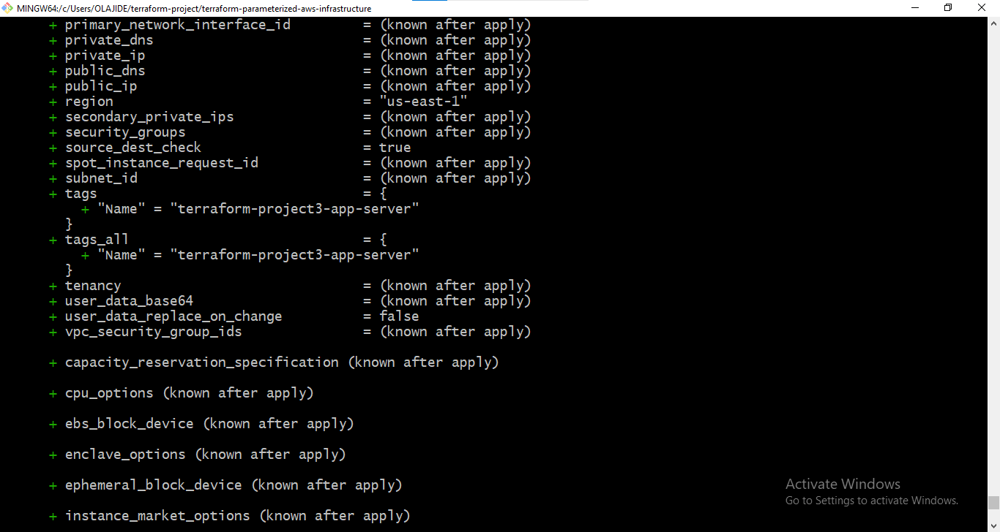

**Evidence:** Terraform variable configuration and infrastructure planning.

This demonstrates the parameterized approach used to control deployment-specific values rather than hard-coding all infrastructure settings directly into the resource configuration.

---

### 16.2 Sensitive Configuration Handling

The project separates sensitive or machine-specific configuration from the reusable Terraform configuration.

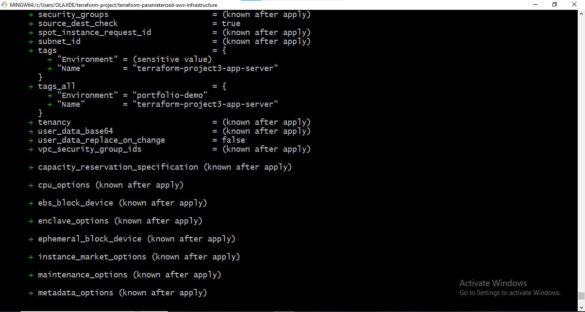

**Evidence:** Sensitive or environment-specific Terraform variable handling.

The project uses `terraform.tfvars` for local values while keeping the reusable example configuration in `terraform.tfvars.example`.

Sensitive local configuration is excluded from version control through `.gitignore`.

---

### 16.3 Final Parameterized Configuration

After resolving the configuration requirements, the final parameterized values were validated through Terraform planning.

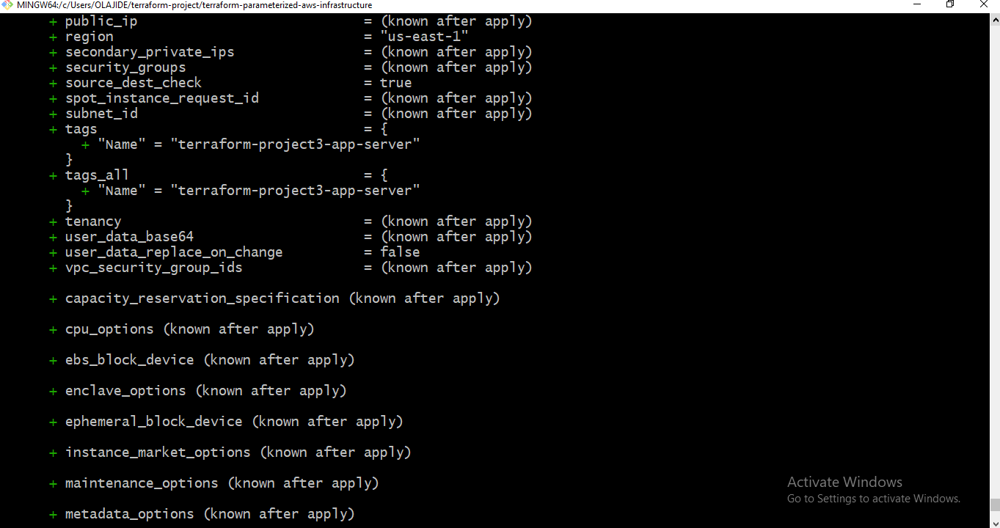

**Evidence:** Final parameterized infrastructure configuration.

The configuration includes parameters such as:

- AWS region
- Availability Zone
- EC2 instance type
- EC2 instance name
- SSH user
- Private key path
- EC2 key pair

This demonstrates that the infrastructure configuration can be controlled through Terraform variables rather than modifying the resource definition for every deployment.

---

### 16.4 Terraform Provisioners in the Execution Plan

The project uses Terraform provisioners to demonstrate automated server configuration after EC2 provisioning.

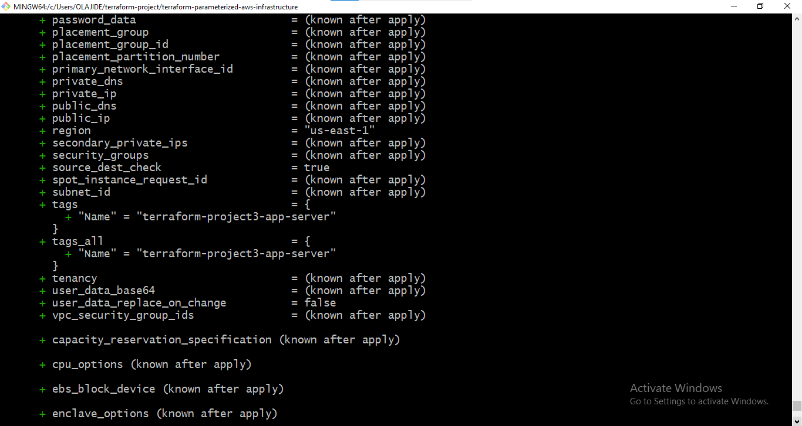

**Evidence:** Terraform plan containing the EC2 provisioning workflow.

The implementation includes:

- `file` provisioner
- `remote-exec` provisioner
- `local-exec` provisioner

The `file` provisioner transfers `web.sh` to the EC2 instance, `remote-exec` executes the configuration remotely, and `local-exec` records the EC2 private IP locally.

---

### 16.5 EC2 Key Pair and Resource Replacement

The EC2 instance requires a valid AWS key pair for SSH-based Terraform provisioner connections.

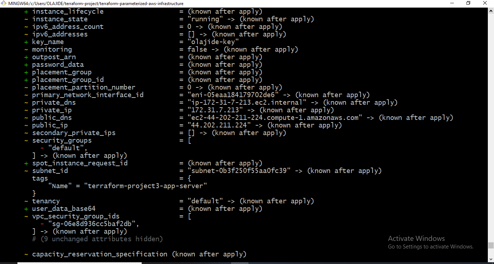

**Evidence:** EC2 key-pair configuration and controlled resource replacement.

The Terraform configuration uses:

    key_name = var.key_name

The key pair was required for successful SSH connectivity between Terraform and the Ubuntu EC2 instance.

The project also demonstrated Terraform's ability to replace an EC2 resource when the existing resource could no longer be reconciled successfully.

---

### 16.6 Security Group Configuration

Network access was validated as part of the EC2 provisioning workflow.

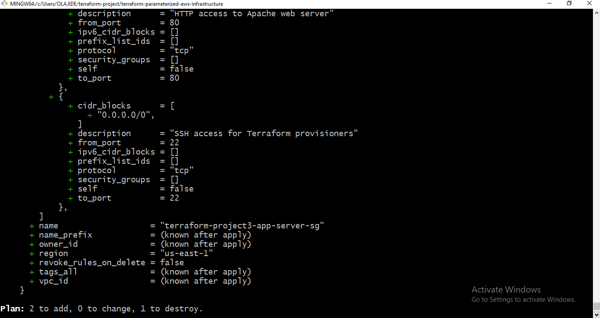

**Evidence:** Security group configuration represented in the Terraform workflow.

The demonstration configuration allowed:

| Protocol | Port | Source | Purpose |
|---|---:|---|---|
| TCP | 22 | `0.0.0.0/0` | SSH administration |
| TCP | 80 | `0.0.0.0/0` | HTTP access |

This configuration was intentionally used for the hands-on demonstration.

For production workloads, SSH access should be restricted to trusted sources or replaced where appropriate with mechanisms such as AWS Systems Manager Session Manager.

---

### 16.7 Successful Terraform Apply

After resolving the configuration and connectivity issues encountered during implementation, Terraform successfully applied the infrastructure configuration.

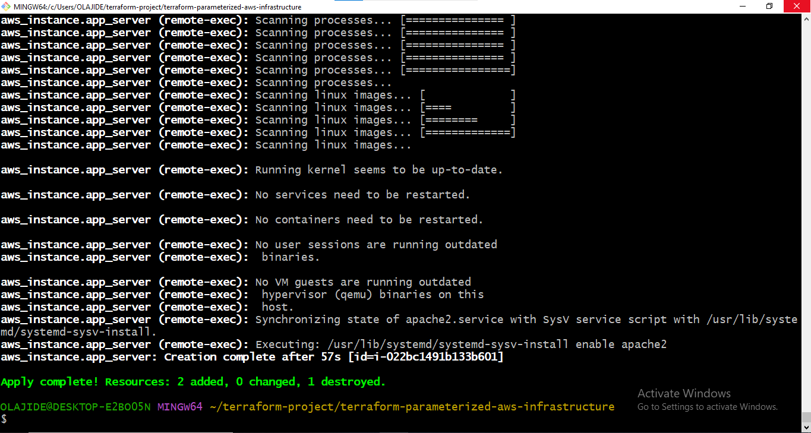

**Evidence:** Successful Terraform infrastructure deployment.

The successful apply demonstrated that Terraform could:

1. Provision the EC2 instance.
2. Establish the required provisioning connection.
3. Transfer the server configuration script.
4. Execute the server configuration.
5. Complete the declared infrastructure workflow.

---

### 16.8 Web Application Verification

After Terraform completed the server configuration, the Apache web server was validated through HTTP access.

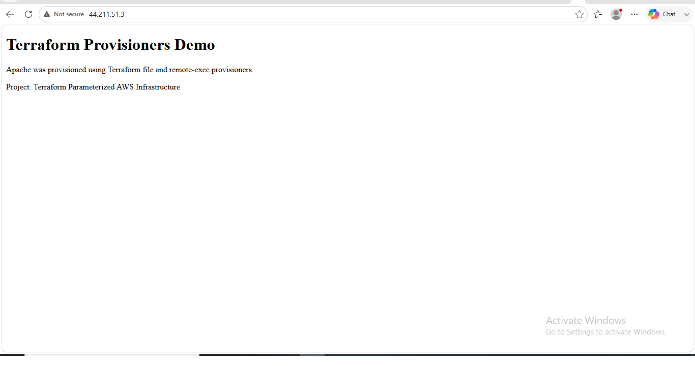

**Evidence:** Successful browser-level verification of the provisioned web server.

The displayed page confirms that the Apache service was configured successfully and that the custom web content was deployed to the EC2 instance.

This provides application-level validation beyond simply confirming that Terraform completed successfully.

---

### 16.9 Terraform Outputs

Terraform outputs were used to expose important attributes of the provisioned EC2 infrastructure.

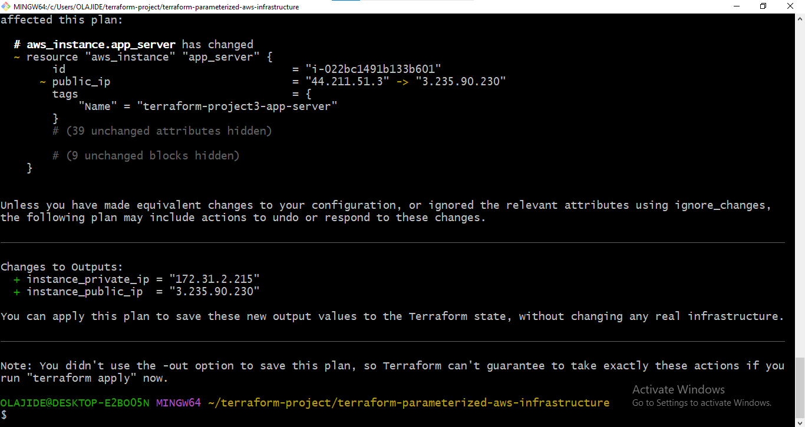

**Evidence:** Terraform output configuration and planning.

The project defines outputs for:

- EC2 public IP address
- EC2 private IP address

These outputs make important infrastructure information available after deployment without requiring manual inspection of the AWS console.

---

### 16.10 Terraform Output Results

The final Terraform output values were verified after successful infrastructure deployment.

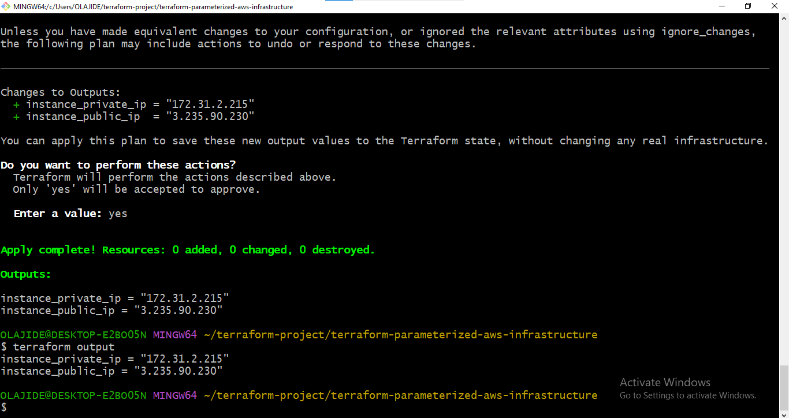

**Evidence:** Actual Terraform-generated EC2 network addresses.

The validated outputs included:

    instance_public_ip  = "44.200.225.123"
    instance_private_ip = "172.31.3.119"

The private IP was also captured locally by the `local-exec` provisioner in:

    private_ips.txt

This provided an additional validation point between Terraform outputs and the generated local file.

---

### 16.11 Apache Service Validation

The Apache service was checked directly on the Ubuntu EC2 instance after provisioning.

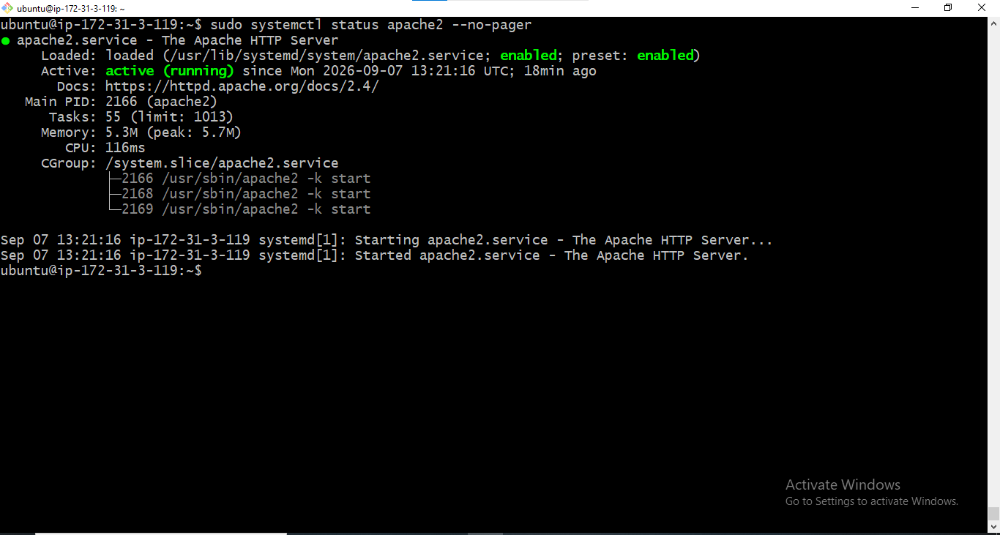

**Evidence:** Apache service confirmed as active and running.

This validation confirmed that the server configuration executed successfully and that the web server was operational at the operating-system service level.

The validation therefore covered more than infrastructure creation; it confirmed that the expected workload was actually running on the provisioned server.

---

### 16.12 Final Apache Web Verification

The final application validation was performed through the browser using the EC2 public IP address.

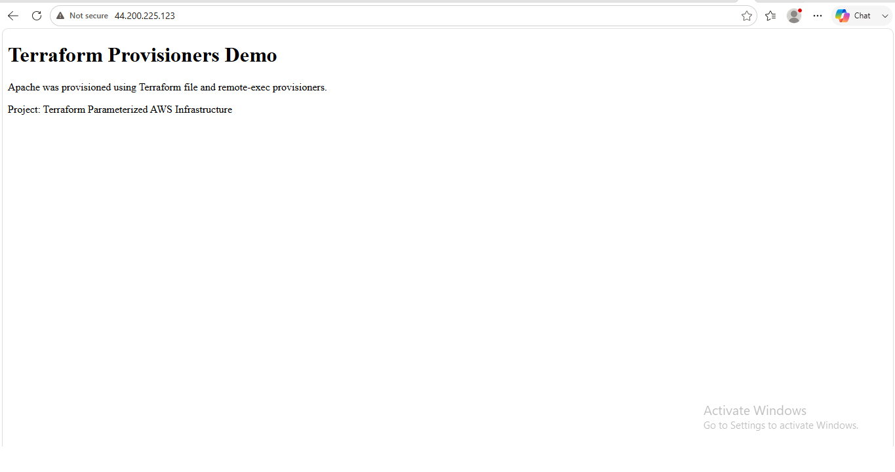

**Evidence:** Final successful browser verification of the deployed Apache application.

The custom page displayed the Terraform project information and confirmed that Apache had been provisioned through the Terraform workflow.

This represents the final application-level validation milestone.

---

### 16.13 End-to-End Evidence Flow

The screenshots collectively demonstrate the progression from infrastructure configuration to a functioning AWS workload:

    Parameterized Variables
            ↓
    Terraform Plan
            ↓
    Provisioner Configuration
            ↓
    EC2 Key Pair Configuration
            ↓
    Security Group Configuration
            ↓
    Terraform Apply
            ↓
    Apache Provisioning
            ↓
    Terraform Outputs
            ↓
    Apache Service Validation
            ↓
    Browser Verification

This provides a traceable evidence chain from Infrastructure as Code to the resulting running application.

---

### 16.14 Evidence Summary

| Evidence Area | Screenshot | What It Demonstrates |
|---|---|---|
| Terraform Variables | `02-project3-tfvars-variable-plan.png` | Parameterized infrastructure configuration |
| Sensitive Configuration | `03-project3-sensitive-variable-plan.png` | Local/environment-specific variable handling |
| Final Variables | `04-project3-final-variable-plan.png` | Finalized deployment parameters |
| Provisioners | `05-project3-provisioners-plan.png` | Terraform provisioner configuration |
| Key Pair | `06-project3-provisioners-key-pair-replacement-plan.png` | SSH key-pair configuration and replacement workflow |
| Security Group | `07-project3-provisioners-security-group-plan.png` | EC2 network access configuration |
| Terraform Apply | `08-project3-provisioners-apply-success.png` | Successful infrastructure provisioning |
| Web Verification | `09-project3-provisioners-web-verification.png` | HTTP/application validation |
| Outputs Plan | `10-project3-outputs-plan.png` | Terraform output configuration |
| Outputs Result | `11-project3-outputs-result.png` | Actual infrastructure output values |
| Apache Service | `12-project3-apache-service-running.png` | Operating-system service validation |
| Final Web Verification | `13-project3-final-apache-web-verification.png` | Final application-level validation |

---

### 16.15 Portfolio Evidence Principle

The screenshots are not intended to replace the Terraform source code.

The Terraform configuration remains the primary implementation artifact, while the screenshots provide visual evidence of the actual deployment and validation process.

Together, the repository provides:

**Infrastructure as Code**

→ **Execution Plan**

→ **AWS Provisioning**

→ **Server Configuration**

→ **Infrastructure Outputs**

→ **Service Validation**

→ **Application Validation**

This combination demonstrates practical Infrastructure as Code implementation rather than a code-only Terraform example.


---

## 17. Limitations, Production Readiness & Future Improvements

This project was intentionally designed as a focused Terraform Infrastructure as Code implementation demonstrating parameterization, EC2 provisioning, Terraform provisioners, outputs, lifecycle management, troubleshooting, validation, security awareness, and cost management.

It successfully demonstrates the core Terraform workflow, but the architecture is not intended to represent a complete production-grade application platform.

Recognizing these boundaries is an important part of professional infrastructure engineering.

---

### 17.1 Current Project Scope

The implemented architecture consists primarily of:

- Terraform
- Amazon EC2
- Ubuntu Linux
- Apache HTTP Server
- EC2 security group
- SSH key-pair authentication
- Terraform variables
- Terraform outputs
- Terraform file provisioner
- Terraform remote-exec provisioner
- Terraform local-exec provisioner

The project was intentionally kept focused so that the Terraform lifecycle and provisioning workflow could be demonstrated clearly.

---

### 17.2 Production Readiness Assessment

The current implementation is suitable as a hands-on Infrastructure as Code portfolio project and development environment demonstration.

However, several areas would require additional engineering before using a similar architecture for a production workload.

| Area | Current Implementation | Production Improvement |
|---|---|---|
| Compute | Single EC2 instance | Auto Scaling Group across multiple Availability Zones |
| Availability | Single-instance architecture | Multi-AZ architecture |
| Load Balancing | Direct access to EC2 public IP | Application Load Balancer |
| Network Architecture | Demonstration-oriented access | Public/private subnet segmentation |
| SSH Access | SSH through security group | AWS Systems Manager Session Manager or restricted administrative access |
| Web Access | HTTP | HTTPS using TLS certificates |
| Security Group | Demonstration access rules | Least-privilege source restrictions |
| Secrets | Local Terraform configuration | AWS Secrets Manager or AWS Systems Manager Parameter Store where appropriate |
| Terraform State | Local state for the project | Remote state with appropriate locking and access controls |
| Server Configuration | Terraform provisioners | User data/cloud-init, SSM, configuration management, immutable images, or deployment automation |
| Observability | Manual validation | CloudWatch metrics, logs, alarms, and centralized monitoring |
| Deployment | Manual Terraform execution | CI/CD pipeline with controlled environments |
| Cost Management | Manual cleanup | Budgets, cost monitoring, lifecycle policies, and automated governance |
| Disaster Recovery | Not implemented | Backup, recovery, and disaster-recovery strategy |

---

### 17.3 Terraform Provisioner Limitation

Terraform provisioners were intentionally used in this project to demonstrate:

- `file`
- `remote-exec`
- `local-exec`

They provide useful hands-on experience with Terraform-driven post-provisioning actions.

However, provisioners are generally not the preferred mechanism for configuring production servers when more maintainable alternatives are available.

For production environments, configuration may instead be handled through:

- EC2 user data
- cloud-init
- AWS Systems Manager
- Ansible
- Configuration management platforms
- Immutable machine images
- CI/CD pipelines
- Container-based deployment models

The engineering principle is to keep infrastructure provisioning predictable and separate from application configuration and deployment responsibilities where practical.

---

### 17.4 Single-Instance Architecture Limitation

The project uses a single EC2 instance.

This is appropriate for demonstrating the Terraform workflow, but a single instance introduces a single point of failure.

A production application requiring high availability would typically require a more resilient architecture such as:

    Application Load Balancer
              ↓
       Auto Scaling Group
          ↙          ↘
       EC2           EC2
         ↓             ↓
       AZ-A           AZ-B

The exact architecture would depend on application requirements, traffic patterns, availability targets, and operational constraints.

---

### 17.5 Network Architecture Improvement

The demonstration architecture intentionally keeps the network design simple.

A production AWS architecture would typically separate externally accessible components from internal application resources.

A more mature design could use:

    Internet
       ↓
    Application Load Balancer
       ↓
    Private Application Subnets
       ↓
    Internal Services
       ↓
    Managed Data Services

This reduces unnecessary direct exposure of application servers and provides greater control over network traffic.

---

### 17.6 SSH Access Improvement

The project uses SSH because Terraform's remote-exec provisioner requires an SSH connection to configure the Ubuntu instance.

For production environments, direct public SSH access should generally be avoided where possible.

Possible alternatives include:

- AWS Systems Manager Session Manager
- Restricted administrative networks
- Bastion architecture where justified
- Private subnets
- VPN connectivity
- Identity-based administrative access

This project therefore demonstrates SSH-based provisioning for educational and portfolio purposes rather than recommending unrestricted public SSH access as a production standard.

---

### 17.7 State Management Improvement

The project demonstrates Terraform state locally and excludes Terraform state files from Git through `.gitignore`.

For a team-managed production environment, Terraform state should normally be stored remotely with appropriate access control and concurrency protection.

A production-oriented implementation could use:

- Amazon S3 for remote state storage
- Appropriate state access controls
- State locking/concurrency protection according to the selected Terraform backend approach
- Separate state for different environments or infrastructure boundaries

Terraform state should be treated as an important infrastructure artifact and protected accordingly.

---

### 17.8 CI/CD Integration

The current project is executed manually from the Terraform working environment.

A natural next step would be integrating the Terraform workflow into a CI/CD pipeline.

A mature workflow could follow:

    Developer
        ↓
    Git Push / Pull Request
        ↓
    Automated Validation
        ↓
    terraform fmt
        ↓
    terraform validate
        ↓
    Security / Policy Checks
        ↓
    terraform plan
        ↓
    Review / Approval
        ↓
    terraform apply
        ↓
    Deployment Validation

This would provide automated and repeatable infrastructure delivery while introducing controlled change management.

---

### 17.9 Security Improvements

The demonstration environment intentionally uses broad access rules to simplify hands-on testing.

A production implementation should improve the security posture by applying:

- Least-privilege security group rules.
- Restricted administrative access.
- Private subnets where appropriate.
- HTTPS instead of plain HTTP.
- Centralized secrets management.
- IAM least privilege.
- Encryption at rest and in transit.
- Centralized logging.
- Security monitoring.
- Regular patching.
- Infrastructure policy validation.

Security should remain part of the infrastructure lifecycle rather than being treated as a final deployment step.

---

### 17.10 Observability Improvements

The project validates the server manually through Terraform outputs, SSH, service status, and browser testing.

A production environment would require continuous observability rather than one-time validation.

Potential improvements include:

- CloudWatch metrics
- CloudWatch Logs
- Application logs
- Health checks
- CloudWatch alarms
- Infrastructure dashboards
- Centralized log aggregation
- Alerting and incident-response integration

The objective would be to detect infrastructure and application problems after deployment rather than relying entirely on manual inspection.

---

### 17.11 Cost Optimization Improvements

The project already demonstrates cost awareness through:

- Small EC2 instance sizing.
- Temporary infrastructure usage.
- Explicit Terraform destruction.
- Avoidance of unnecessary resources.

For larger environments, cost optimization could be extended through:

- AWS Cost Explorer
- AWS Budgets
- Compute right-sizing
- Savings Plans
- Appropriate storage lifecycle policies
- Data-transfer analysis
- NAT Gateway cost analysis
- VPC endpoint evaluation
- Automated cleanup of temporary resources
- Environment-specific resource controls

Cost optimization should be evaluated together with availability, performance, security, and operational requirements.

---

### 17.12 Future Project Extensions

The Terraform implementation provides a foundation for progressively more advanced AWS Infrastructure as Code projects.

Potential extensions include:

1. Build a reusable VPC module.
2. Create public and private subnets.
3. Add an S3 Gateway VPC Endpoint.
4. Deploy an Application Load Balancer.
5. Introduce an Auto Scaling Group.
6. Move application servers into private subnets.
7. Introduce AWS Systems Manager Session Manager.
8. Implement remote Terraform state.
9. Add environment separation such as development, staging, and production.
10. Add CI/CD automation for Terraform.
11. Add infrastructure security scanning.
12. Add policy-as-code validation.
13. Introduce CloudWatch monitoring and alerting.
14. Deploy a more complete multi-tier AWS application architecture.

These extensions would build directly on the Infrastructure as Code principles demonstrated in this project.

---

### 17.13 What This Project Demonstrates

Despite its intentionally focused scope, the project demonstrates several practical DevOps engineering capabilities:

- Infrastructure as Code with Terraform.
- AWS EC2 provisioning.
- Parameterized Terraform configuration.
- Terraform variable management.
- Terraform outputs.
- Terraform provisioners.
- SSH-based infrastructure connectivity.
- Automated Linux server configuration.
- Apache deployment.
- Infrastructure validation.
- Resource replacement and reconciliation.
- Terraform lifecycle management.
- Troubleshooting of real infrastructure failures.
- Security awareness.
- Cost awareness.
- Git/GitHub-based infrastructure documentation.

---

### 17.14 Engineering Maturity Demonstrated

An important engineering lesson from this project is that production readiness is not determined only by whether an application can be deployed successfully.

A professional infrastructure engineer must also evaluate:

    Reliability
    Security
    Scalability
    Observability
    Cost
    Maintainability
    Recoverability
    Operational Overhead

The current project deliberately focuses on Terraform fundamentals and EC2 automation while documenting where a production architecture would require additional engineering.

This distinction demonstrates the ability to evaluate infrastructure beyond simply making it work.

---

### 17.15 Engineering Lesson

The goal of Infrastructure as Code is not merely to automate resource creation.

The larger objective is to create infrastructure that is:

**Repeatable**

**Reviewable**

**Version Controlled**

**Testable**

**Recoverable**

**Secure**

**Cost-Aware**

**Operationally Maintainable**

This project establishes those principles at a focused EC2 level and provides a foundation for progressively more advanced AWS infrastructure automation.


---

## 18. Professional DevOps & IaC Practices Demonstrated

This project demonstrates more than the ability to write Terraform configuration. It demonstrates a practical Infrastructure as Code workflow covering infrastructure definition, parameterization, provisioning, validation, troubleshooting, lifecycle management, security awareness, cost awareness, documentation, and controlled cleanup.

### 18.1 Infrastructure as Code

The infrastructure was defined declaratively using Terraform rather than being created manually through the AWS Management Console.

Terraform was used to manage:

- Amazon EC2 infrastructure
- Security group configuration
- Instance parameters
- SSH access configuration
- Provisioning workflow
- Infrastructure outputs
- Resource replacement
- Infrastructure destruction

This provides a repeatable and version-controlled approach to infrastructure management.

### 18.2 Parameterized Infrastructure

The project separates configurable values from infrastructure logic through Terraform variables.

Examples include:

- AWS region
- Availability Zone
- AMI ID
- EC2 instance type
- Instance name
- SSH username
- SSH private-key path
- EC2 key-pair name

This allows the same Terraform configuration to be adapted without rewriting the core infrastructure definition.

### 18.3 Declarative Infrastructure Management

Terraform was used to define the desired infrastructure state and reconcile AWS resources against that configuration.

The project demonstrated:

    Terraform Configuration
            ↓
    terraform plan
            ↓
    Review Desired Changes
            ↓
    terraform apply
            ↓
    AWS Infrastructure
            ↓
    Validation
            ↓
    Reconciliation / Replacement
            ↓
    terraform destroy

This demonstrates the core Terraform operating model:

> Define the desired state, review the proposed changes, apply the changes, validate the resulting infrastructure, and manage the lifecycle through Terraform.

### 18.4 Infrastructure Validation

Validation was performed at multiple layers rather than relying only on a successful Terraform command.

Validation included:

- Terraform configuration validation
- Terraform execution planning
- EC2 resource creation
- Terraform outputs
- Private IP capture
- SSH connectivity
- Apache service status
- HTTP accessibility
- Browser-based application verification
- Resource replacement
- Infrastructure destruction

This layered validation approach helps distinguish between:

- Terraform configuration problems
- AWS infrastructure problems
- Network connectivity problems
- SSH problems
- Application/service problems

### 18.5 Troubleshooting and Root-Cause Analysis

The deployment encountered several real infrastructure issues, including:

- AMI architecture incompatibility
- Windows SSH private-key path handling
- EC2 key-pair configuration
- AWS API/DNS connectivity problems
- SSH connection timeout
- Provisioner execution failure
- Terraform resource tainting
- Public IP changes
- HTTP connectivity problems

Rather than treating Terraform as a black box, the deployment was investigated across the infrastructure stack.

The troubleshooting process followed an engineering pattern:

    Observe Failure
          ↓
    Identify Affected Layer
          ↓
    Inspect Terraform / AWS State
          ↓
    Verify Network / Security / Access
          ↓
    Correct Root Cause
          ↓
    Re-apply or Replace Resource
          ↓
    Validate End-to-End

This is an important DevOps skill because production incidents rarely belong to a single tool or layer.

### 18.6 Controlled Resource Replacement

The project demonstrated controlled replacement of an EC2 resource using:

    terraform apply -replace=aws_instance.app_server

Terraform reported:

    Apply complete! Resources: 1 added, 0 changed, 1 destroyed.

This demonstrated the ability to recover from an unhealthy or failed resource while maintaining Terraform state awareness.

### 18.7 Infrastructure State Awareness

Terraform state was used to understand the resources managed by the project.

The following command was used during troubleshooting:

    terraform state list

The resulting managed resources included:

- `aws_instance.app_server`
- `aws_security_group.app_server`

Understanding Terraform state is essential for determining what Terraform currently manages and how Terraform will reconcile future configuration changes.

### 18.8 Security Awareness

The project incorporated security considerations into the infrastructure workflow.

Examples include:

- SSH private-key protection
- `.gitignore` protection for private keys
- Exclusion of `terraform.tfvars`
- Exclusion of Terraform state files
- EC2 key-pair authentication
- Security group access control
- Least-privilege considerations
- Production recommendations for restricting SSH access

The project also explicitly identifies the demonstration security group's `0.0.0.0/0` SSH access as unsuitable for production.

### 18.9 Cost Awareness

Cost considerations were incorporated into infrastructure design and lifecycle management.

The project used a small EC2 instance for the demonstration and destroyed the infrastructure after validation.

This demonstrates an important cloud engineering principle:

> Infrastructure that is no longer required should not remain running unnecessarily.

The project also identifies production cost considerations such as:

- Instance right-sizing
- Data transfer
- Public IPv4 usage
- NAT Gateway costs
- Load balancer costs
- Storage costs
- VPC endpoint considerations
- Managed-service cost trade-offs
- Automated cleanup

### 18.10 Documentation as an Engineering Practice

The project was documented as a complete engineering workflow rather than as a collection of Terraform files.

The documentation captures:

- Business objectives
- Architecture
- Technology stack
- Infrastructure configuration
- Parameterization
- Provisioning
- Deployment workflow
- Validation
- Troubleshooting
- Lifecycle management
- Security
- Cost optimization
- Testing
- Implementation evidence
- Limitations
- Production improvements

This makes the repository useful not only as source code but also as technical evidence of the engineering process.

### 18.11 Evidence-Based Portfolio Development

The project documentation is supported by screenshots captured from the actual implementation.

The evidence covers important milestones such as:

- Terraform planning
- Variable configuration
- Provisioner configuration
- Security group configuration
- Successful deployment
- Terraform outputs
- Apache service validation
- Browser-based application verification

The project therefore demonstrates actual hands-on implementation rather than presenting Terraform configuration without operational evidence.

### 18.12 Reproducibility

The Terraform configuration, variables, provisioning script, provider configuration, dependency lock file, and documentation provide the foundation for reproducing the infrastructure.

A future engineer can review the repository and understand:

1. What infrastructure is being created.
2. Which values are configurable.
3. How the EC2 instance is provisioned.
4. How the application is validated.
5. How infrastructure replacement is handled.
6. How infrastructure is destroyed.
7. Which areas require additional production hardening.

Reproducibility is one of the primary advantages of Infrastructure as Code.

### 18.13 Engineering Maturity Demonstrated

The project demonstrates progression beyond simply creating an EC2 instance with Terraform.

It demonstrates awareness of:

- Desired state management
- Terraform state
- Parameterization
- Resource dependencies
- Provisioning behavior
- Network troubleshooting
- SSH troubleshooting
- Security boundaries
- Cost implications
- Lifecycle management
- Resource replacement
- Testing and validation
- Production-readiness considerations
- Technical documentation

The most important outcome is therefore not the EC2 instance itself.

The important outcome is demonstrating the ability to **design, deploy, troubleshoot, validate, document, secure, and manage cloud infrastructure using Infrastructure as Code**.

### 18.14 Portfolio Value

This project provides evidence of practical skills relevant to roles such as:

- AWS Cloud Engineer
- DevOps Engineer
- Cloud Infrastructure Engineer
- Infrastructure Engineer
- Junior-to-Mid-Level Terraform Engineer
- Site Reliability / Platform Engineering roles

The repository demonstrates practical exposure to:

**AWS + Terraform + EC2 + Networking + Security Groups + SSH + Provisioning + Bash + Infrastructure Lifecycle + Troubleshooting + Git/GitHub**

It also provides a foundation for future projects involving:

- VPC architecture
- Private subnets
- S3 Gateway VPC Endpoints
- Application Load Balancers
- Auto Scaling Groups
- Systems Manager
- Remote Terraform state
- CI/CD
- Security scanning
- Observability
- Production-grade AWS architectures

### 18.15 Engineering Lesson

A strong Infrastructure as Code implementation is not measured only by whether `terraform apply` succeeds.

Professional DevOps engineering requires the complete lifecycle:

**Design → Define → Plan → Apply → Validate → Troubleshoot → Reconcile → Secure → Optimize → Document → Destroy**

That complete lifecycle is the primary engineering capability demonstrated by this project.


---

## 19. Project Completion Summary & Key Takeaways

This project successfully demonstrated the end-to-end use of Terraform to define, provision, configure, validate, troubleshoot, replace, document, and destroy AWS infrastructure.

The implementation focused on building a parameterized EC2-based application environment while maintaining awareness of security, cost, operational reliability, and production-readiness considerations.

### 19.1 Project Objectives Achieved

The project successfully achieved the primary technical objectives:

- Defined AWS infrastructure using Terraform.
- Parameterized infrastructure configuration using Terraform variables.
- Used a region-aware AMI mapping.
- Provisioned an Ubuntu EC2 instance.
- Configured an EC2 security group.
- Configured SSH access using an EC2 key pair.
- Used Terraform file provisioning.
- Used Terraform remote-exec provisioning.
- Used Terraform local-exec provisioning.
- Installed and configured Apache automatically.
- Generated Terraform outputs for infrastructure information.
- Captured the EC2 private IP using local execution.
- Validated SSH connectivity.
- Validated the Apache service.
- Validated the web application through a browser.
- Troubleshot real deployment failures.
- Replaced a failed EC2 resource using Terraform.
- Verified Terraform-managed resources through state.
- Destroyed the infrastructure after successful validation.
- Documented implementation evidence and engineering lessons.

### 19.2 Infrastructure Outcome

The final deployment successfully produced a working EC2-based web server.

The validated infrastructure included:

| Component | Final Outcome |
|---|---|
| AWS Region | `us-east-1` |
| Availability Zone | `us-east-1a` |
| EC2 Instance Type | `t3.micro` |
| Operating System | Ubuntu |
| Web Server | Apache |
| Terraform Provisioning | Successful |
| SSH Connectivity | Successful |
| Apache Service | Active and running |
| HTTP Application | Successfully verified |
| Terraform Outputs | Successfully generated |
| Resource Replacement | Successfully demonstrated |
| Infrastructure Cleanup | Successfully completed |

The final validated deployment produced:

- Public IP: `44.200.225.123`
- Private IP: `172.31.3.119`

The private IP was also captured through the Terraform `local-exec` provisioner.

### 19.3 Deployment Recovery Demonstrated

The project did not follow a perfectly linear deployment path.

Real infrastructure issues were encountered and resolved during implementation.

The deployment demonstrated recovery from:

- Incompatible EC2 AMI architecture
- Incorrect Windows private-key path handling
- Missing EC2 key-pair configuration
- AWS API/DNS connectivity problems
- SSH connectivity timeout
- Provisioner execution failure
- Terraform resource tainting
- Public IP changes
- HTTP connectivity issues

The final recovery workflow successfully used:

    terraform apply -replace=aws_instance.app_server

Terraform then reported:

    Apply complete! Resources: 1 added, 0 changed, 1 destroyed.

This provides practical evidence that the project included real troubleshooting and infrastructure recovery rather than only a successful first deployment.

### 19.4 Validation Outcome

The infrastructure was validated through multiple independent checks.

The validation sequence included:

    terraform validate
    terraform plan
    terraform apply
    terraform output
    terraform state list

This was followed by operational validation through:

- SSH connection to the EC2 instance
- Apache service verification
- HTTP connectivity testing
- Browser verification of the custom Apache page
- Terraform output verification
- Private IP file verification

The infrastructure was therefore validated at both the Terraform control-plane level and the application/service level.

### 19.5 Infrastructure Cleanup

After validation was completed, the infrastructure was intentionally destroyed.

Terraform reported:

    Destroy complete! Resources: 2 destroyed.

This confirms that the project demonstrated the complete infrastructure lifecycle rather than stopping after deployment.

The final lifecycle was:

    Define
       ↓
    Initialize
       ↓
    Validate
       ↓
    Plan
       ↓
    Apply
       ↓
    Provision
       ↓
    Validate
       ↓
    Troubleshoot / Replace
       ↓
    Revalidate
       ↓
    Destroy

### 19.6 Key Technical Skills Demonstrated

The project demonstrates practical exposure to:

**Infrastructure as Code**
- Terraform configuration
- Declarative infrastructure
- Variables
- Outputs
- Terraform state
- Resource replacement
- Infrastructure lifecycle management

**AWS**
- Amazon EC2
- Security Groups
- EC2 key pairs
- Availability Zones
- AWS regions
- Public and private IP addressing

**Linux**
- Ubuntu
- Apache
- systemd service management
- SSH
- Bash scripting
- Linux web-server configuration

**Automation**
- Terraform file provisioner
- Terraform remote-exec
- Terraform local-exec
- Automated Apache installation
- Automated web-page configuration

**Troubleshooting**
- AMI architecture compatibility
- DNS connectivity
- SSH connectivity
- Security group validation
- Provisioner failures
- Terraform resource replacement
- HTTP service troubleshooting

**DevOps Practices**
- Version-controlled infrastructure
- Repeatable deployment
- Validation
- Documentation
- Security awareness
- Cost awareness
- Lifecycle management
- Evidence-based implementation

### 19.7 Key Engineering Lessons

The most important lessons from this project are:

1. **Infrastructure compatibility matters.**

   EC2 instance types and AMIs must use compatible architectures. A technically valid AMI is not automatically compatible with every EC2 instance type.

2. **Terraform errors must be investigated across layers.**

   A Terraform provisioner failure may actually be caused by networking, security groups, SSH access, DNS, or the operating system.

3. **Terraform state is operationally important.**

   Understanding what Terraform manages is essential when diagnosing failed resources and performing controlled replacements.

4. **Successful provisioning does not equal successful application deployment.**

   Infrastructure must be validated from the resource level through to the application level.

5. **Public IP addresses should not be treated as permanent identifiers for ordinary EC2 instances.**

   Lifecycle operations can result in a different public IPv4 address, requiring outputs and validation to be refreshed.

6. **Security must be considered during infrastructure design.**

   Demonstration configurations may intentionally be simplified, but production environments require restricted access, least privilege, stronger network boundaries, and protected credentials.

7. **Cost management is part of cloud engineering.**

   Unused resources should be removed, and architecture decisions should consider compute, networking, storage, data transfer, and managed-service costs.

8. **Documentation is part of the engineering deliverable.**

   A professional infrastructure project should explain not only what was built, but also why it was built, how it works, how it was validated, what failed, how failures were resolved, and what should change before production use.

### 19.8 Portfolio Achievement

This project can be presented as a practical Terraform/AWS Infrastructure as Code portfolio project demonstrating the ability to move beyond individual Terraform commands into a complete infrastructure workflow.

It demonstrates the ability to:

> **Design → Parameterize → Provision → Configure → Validate → Troubleshoot → Replace → Secure → Optimize → Document → Destroy**

This is the core value of the project from a DevOps engineering perspective.

### 19.9 Recommended Professional Positioning

The project should be positioned as a hands-on Infrastructure as Code implementation rather than simply as a Terraform tutorial exercise.

A concise professional description is:

> **Built and validated a parameterized AWS infrastructure deployment using Terraform, automating EC2 provisioning, Apache configuration, SSH-based server setup, infrastructure outputs, resource replacement, troubleshooting, validation, and lifecycle cleanup.**

This positioning emphasizes practical engineering capabilities rather than merely listing Terraform as a tool.

### 19.10 Final Project Takeaway

The project demonstrates that Infrastructure as Code is not simply about creating cloud resources.

A professional DevOps engineer must understand the complete lifecycle of infrastructure:

**Why it is needed → How it should be designed → How it should be automated → How it should be validated → How failures should be diagnosed → How resources should be recovered → How security and cost should be managed → How the environment should be documented → How it should be safely removed.**

That complete lifecycle is the primary engineering capability demonstrated by this project.


---

## 20. Repository Usage & Deployment Guide

This section provides a practical workflow for engineers who want to review, reproduce, validate, or extend the Terraform project.

The repository is designed so that the infrastructure configuration, variables, provisioning script, validation workflow, and documentation can be reviewed independently and then used together as an Infrastructure as Code implementation.

### 20.1 Repository

GitHub repository:

    https://github.com/olajide-adedayo/terraform-parameterized-aws-infrastructure

The repository contains the Terraform configuration, supporting files, screenshots, and project documentation.

### 20.2 Prerequisites

Before using the project, ensure the following are available:

- AWS account
- AWS CLI
- Terraform
- Git
- SSH private key associated with the EC2 key pair
- AWS credentials with sufficient permissions
- Internet connectivity
- Windows with Git Bash or an equivalent Unix-like shell environment

The project was implemented using:

- Terraform `1.14.8`
- AWS
- Ubuntu
- Amazon EC2
- Git Bash on Windows

### 20.3 AWS Authentication

Terraform requires valid AWS credentials before it can communicate with AWS.

Verify the AWS CLI identity with:

    aws sts get-caller-identity

The command should return the AWS account and identity associated with the active credentials.

AWS credentials should never be hard-coded into Terraform configuration files.

### 20.4 Clone the Repository

Clone the repository using Git:

    git clone https://github.com/olajide-adedayo/terraform-parameterized-aws-infrastructure.git

Change into the project directory:

    cd terraform-parameterized-aws-infrastructure

Confirm the repository contents:

    ls

### 20.5 Review the Terraform Configuration

Before making infrastructure changes, review the main Terraform files:

- `main.tf`
- `variables.tf`
- `outputs.tf`
- `providers.tf`
- `terraform.tfvars.example`
- `web.sh`
- `.gitignore`

The purpose of each file is documented in Section 12 of this README.

### 20.6 Create the Local Terraform Variables File

The repository provides:

    terraform.tfvars.example

Create a local `terraform.tfvars` file from the example:

    cp terraform.tfvars.example terraform.tfvars

Update the local values where required.

Example:

    aws_region        = "us-east-1"
    availability_zone = "us-east-1a"
    instance_type     = "t3.micro"
    instance_name     = "terraform-parameterized-app-server"
    ssh_user          = "ubuntu"
    private_key_path  = "C:/Users/YOUR_USERNAME/Downloads/olajide-key.pem"
    key_name          = "olajide-key"

The actual private-key path must match the location of the local SSH private key.

### 20.7 Protect Local Configuration

The local `terraform.tfvars` file should not be committed to Git because it contains environment-specific configuration.

The repository `.gitignore` excludes:

    terraform.tfvars

Private SSH keys are also excluded:

    *.pem

Terraform state files are excluded as well:

    *.tfstate
    *.tfstate.*

This prevents common sensitive or environment-specific files from being accidentally committed.

### 20.8 Initialize Terraform

Initialize the Terraform working directory:

    terraform init

This downloads the required Terraform provider and initializes the local Terraform working environment.

The Terraform dependency lock file:

    .terraform.lock.hcl

is intentionally tracked in the repository so provider dependency selections can be reproduced more consistently.

### 20.9 Format the Terraform Configuration

Run Terraform formatting:

    terraform fmt

This ensures Terraform configuration follows standard Terraform formatting conventions.

### 20.10 Validate the Configuration

Run:

    terraform validate

Terraform should report that the configuration is valid.

Validation should be performed before creating or modifying AWS infrastructure.

### 20.11 Review the Execution Plan

Generate the Terraform execution plan:

    terraform plan

Review the proposed infrastructure changes before applying them.

The plan should be inspected for:

- Resources to be created
- Resources to be modified
- Resources to be destroyed
- Variable values
- Security group configuration
- EC2 configuration
- Provisioner-related configuration
- Unexpected changes

A plan should never be treated as an automatic approval to apply infrastructure.

### 20.12 Apply the Infrastructure

After reviewing the plan, deploy the infrastructure:

    terraform apply

Review the proposed changes and confirm the operation when Terraform requests approval.

Terraform then creates the required AWS resources and executes the configured provisioning workflow.

### 20.13 Provisioning Workflow

During deployment, the EC2 instance is created and Terraform performs the configured provisioning actions.

The workflow includes:

    EC2 Instance Creation
            ↓
    File Provisioner
            ↓
    web.sh copied to EC2
            ↓
    Remote-Exec
            ↓
    Apache Installation
            ↓
    Apache Configuration
            ↓
    Apache Startup
            ↓
    Local-Exec
            ↓
    Private IP Capture

This demonstrates how Terraform can coordinate infrastructure creation with configuration actions.

### 20.14 Retrieve Terraform Outputs

After deployment, retrieve the outputs:

    terraform output

The project exposes:

- `instance_public_ip`
- `instance_private_ip`

The public IP can be used for SSH and HTTP validation while the infrastructure remains active.

### 20.15 Validate SSH Access

Use the Terraform public IP output to connect to the Ubuntu instance:

    ssh -i "C:/Users/YOUR_USERNAME/Downloads/olajide-key.pem" ubuntu@<PUBLIC_IP>

Replace `<PUBLIC_IP>` with the current Terraform output.

Successful SSH access confirms that:

- The EC2 instance is running.
- The public IP is reachable.
- The key pair is correctly configured.
- The private key is usable.
- Network access to TCP/22 is available.

### 20.16 Validate Apache

After connecting to the server, verify Apache:

    sudo systemctl status apache2

The service should report an active and running state.

This confirms that the remote provisioning workflow successfully configured the web server.

### 20.17 Validate the Web Application

Open the current EC2 public IP in a browser:

    http://<PUBLIC_IP>

The project should display the custom Apache page containing the Terraform provisioning demonstration content.

This provides an application-level validation beyond Terraform's infrastructure-level success message.

### 20.18 Validate the Captured Private IP

The `local-exec` provisioner creates:

    private_ips.txt

The captured value can be reviewed with:

    cat private_ips.txt

The value should correspond to the EC2 instance private IP reported by Terraform.

### 20.19 Review Terraform State

List Terraform-managed resources:

    terraform state list

The project demonstrated state entries including:

    aws_instance.app_server
    aws_security_group.app_server

Terraform state provides the mapping between the configuration and the infrastructure resources managed by Terraform.

### 20.20 Controlled Resource Replacement

If the EC2 resource requires controlled replacement, Terraform can replace the specific resource using:

    terraform apply -replace=aws_instance.app_server

This approach allows Terraform to perform the replacement while maintaining awareness of the resource in its state.

The project successfully demonstrated this workflow during troubleshooting.

### 20.21 Revalidate After Replacement

After replacement, retrieve the current outputs:

    terraform output

The EC2 public IP may have changed.

Always use the current Terraform output rather than assuming a previous public IP remains valid.

Repeat the validation workflow:

1. Retrieve the current public IP.
2. Test SSH connectivity.
3. Verify Apache.
4. Verify HTTP accessibility.
5. Confirm the Terraform outputs.
6. Confirm the application page.

### 20.22 Destroy the Infrastructure

When the environment is no longer required, destroy it:

    terraform destroy

Review the proposed resources and confirm the destruction.

The project successfully completed cleanup with:

    Destroy complete! Resources: 2 destroyed.

Destroying temporary infrastructure is an important cloud cost-control and lifecycle-management practice.

### 20.23 Recommended Reproduction Workflow

For another engineer reproducing this project, the recommended workflow is:

    Clone Repository
          ↓
    Configure AWS Credentials
          ↓
    Review Terraform Files
          ↓
    Create terraform.tfvars
          ↓
    Verify SSH Key
          ↓
    terraform init
          ↓
    terraform fmt
          ↓
    terraform validate
          ↓
    terraform plan
          ↓
    Review Plan
          ↓
    terraform apply
          ↓
    terraform output
          ↓
    SSH Validation
          ↓
    Apache Validation
          ↓
    Browser Validation
          ↓
    Review Terraform State
          ↓
    terraform destroy

### 20.24 Important Operational Notes

This repository is a portfolio and learning implementation.

Before using the architecture in a production environment, additional engineering controls should be considered, including:

- Remote Terraform state
- State locking/concurrency protection
- IAM least privilege
- Restricted SSH access or AWS Systems Manager
- Private subnets
- HTTPS
- Load balancing
- High availability
- Auto Scaling
- Centralized logging
- Monitoring and alerting
- Secrets management
- CI/CD
- Security scanning
- Policy validation
- Backup and disaster recovery planning

These improvements are discussed in Section 17.

### 20.25 Reproduction Principle

The purpose of this guide is not simply to provide commands.

It establishes a repeatable operational process:

> **Prepare → Review → Validate → Plan → Apply → Verify → Operate → Destroy**

Following this workflow reduces accidental infrastructure changes and encourages disciplined Infrastructure as Code practices.

### 20.26 Engineering Lesson

A professional Terraform repository should be usable by someone other than its original author.

A strong repository therefore needs more than valid `.tf` files.

It should provide enough information for another engineer to understand:

- What the project does.
- What is required before deployment.
- How variables are configured.
- How infrastructure is deployed.
- How the deployment is validated.
- How failures can be investigated.
- How resources can be replaced.
- How infrastructure can be safely destroyed.
- Which areas require additional production hardening.

This repository is structured to provide that complete operational path.
